# Documento de Diseño Técnico — FESC Connect

**Versión:** 1.0.0  
**Fecha:** 2025  
**Estado:** Draft  
**Feature:** fesc-connect  

---

## Tabla de Contenidos

1. [Visión General](#1-visión-general)
2. [Arquitectura del Sistema](#2-arquitectura-del-sistema)
3. [Arquitectura Frontend](#3-arquitectura-frontend)
4. [Arquitectura Backend](#4-arquitectura-backend)
5. [Modelo de Dominio](#5-modelo-de-dominio)
6. [Esquema de Base de Datos](#6-esquema-de-base-de-datos)
7. [Contratos de API](#7-contratos-de-api)
8. [Arquitectura WebSocket](#8-arquitectura-websocket)
9. [Algoritmo Score de Compatibilidad](#9-algoritmo-score-de-compatibilidad)
10. [Flujos de Usuario Clave](#10-flujos-de-usuario-clave)
11. [Decisiones de Arquitectura (ADRs)](#11-decisiones-de-arquitectura-adrs)
12. [Correctness Properties](#12-correctness-properties)
13. [Estrategia de Testing](#13-estrategia-de-testing)
14. [Estructura de Carpetas Completa](#14-estructura-de-carpetas-completa)
15. [Roadmap MVP vs Post-MVP](#15-roadmap-mvp-vs-post-mvp)
16. [Riesgos y Mitigaciones](#16-riesgos-y-mitigaciones)

---

## 1. Visión General

### 1.1 Descripción del Producto

FESC Connect es una red social universitaria mobile-first exclusiva para estudiantes de la Universidad FESC. La plataforma combina elementos de descubrimiento social (inspirado en Tinder/Bumble), networking académico (inspirado en LinkedIn) y expresión personal (inspirado en Instagram), adaptados al ecosistema universitario colombiano.

**Diferenciador clave:** A diferencia de Tinder, FESC Connect no requiere match mutuo para iniciar conversación. Cualquier usuario puede escribirle a otro directamente. El match mutuo únicamente desbloquea la categoría especial **Conexión_Destacada**.

### 1.2 Principios de Diseño

- **Mobile-first:** Diseñado exclusivamente para dispositivos móviles (iOS y Android)
- **Modo oscuro por defecto:** Experiencia visual premium con tema oscuro
- **Privacidad por diseño:** Datos mínimos necesarios, control total del usuario
- **Escalabilidad horizontal:** Arquitectura preparada para crecer de 100 a 100,000 usuarios
- **Seguridad universitaria:** Verificación institucional obligatoria

### 1.3 Diagrama de Capas de Alto Nivel

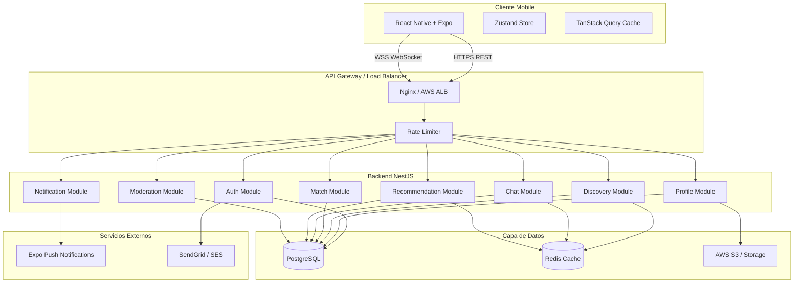

### 1.4 Flujo de Datos Principal

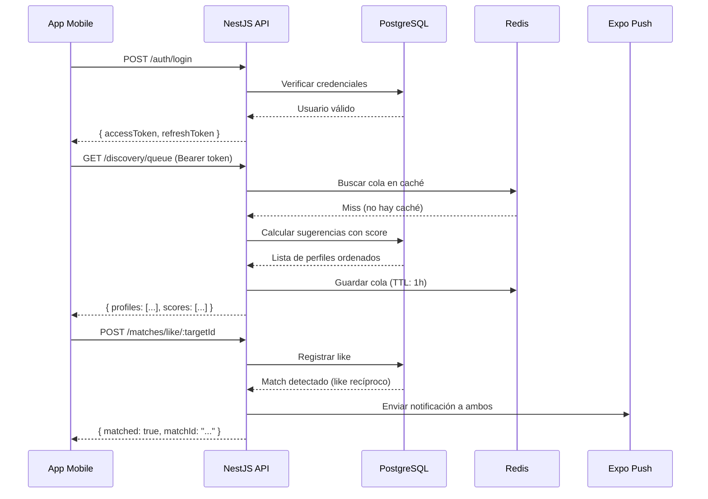

---

## 2. Arquitectura del Sistema

### 2.1 Diagrama de Componentes

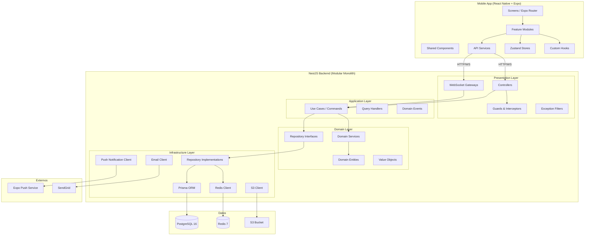

### 2.2 Módulos del Backend

| Módulo | Responsabilidad | Dependencias |
|--------|----------------|--------------|
| `AuthModule` | Registro, login, JWT, verificación email, recuperación contraseña | UserModule, EmailModule |
| `ProfileModule` | CRUD de perfil, fotos, intereses, preferencias | StorageModule |
| `DiscoveryModule` | Cola de sugerencias, filtros, exclusiones | ProfileModule, RecommendationModule, ModerationModule |
| `MatchModule` | Likes, matches mutuos, Conexión_Destacada | ProfileModule, NotificationModule |
| `ChatModule` | Mensajería en tiempo real, historial, archivado | ProfileModule, ModerationModule, NotificationModule |
| `RecommendationModule` | Score_de_Compatibilidad, modelo de preferencias | ProfileModule |
| `NotificationModule` | Push notifications, preferencias de notificación | ExpoModule |
| `ModerationModule` | Reportes, bloqueos, shadow ban, rate limiting | ProfileModule, NotificationModule |

### 2.3 Estrategia de Caché con Redis

```
Redis Key Patterns:
  discovery:queue:{userId}          → Cola de perfiles sugeridos (TTL: 1h)
  discovery:seen:{userId}:{targetId} → Registro de perfiles vistos (TTL: 24h)
  score:{userA}:{userB}             → Score de compatibilidad (TTL: 6h)
  session:refresh:{tokenHash}       → Token de refresco activo (TTL: 30d)
  rate:ip:{ip}                      → Contador de peticiones por IP (TTL: 1m)
  rate:user:{userId}                → Contador de peticiones por usuario (TTL: 1m)
  rate:msg:{userId}                 → Contador de mensajes sin match (TTL: 1h)
  online:{userId}                   → Estado online del usuario (TTL: 30s, renovado por heartbeat)
```

### 2.4 Infraestructura de Producción

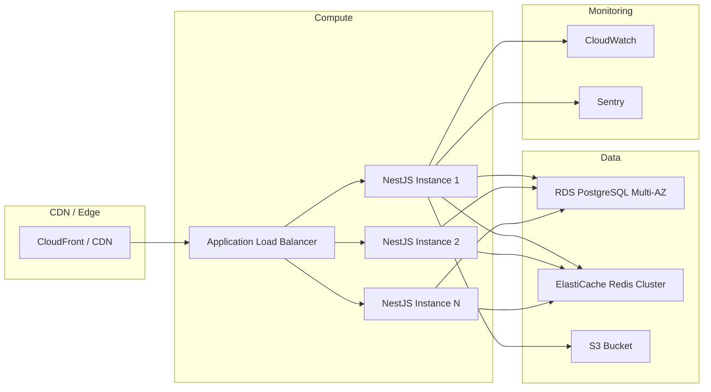

---

## 3. Arquitectura Frontend

### 3.1 Estructura de Carpetas Detallada

```
/src
├── app/                          # Expo Router — Screens y navegación
│   ├── (auth)/                   # Grupo de rutas no autenticadas
│   │   ├── _layout.tsx           # Layout del grupo auth
│   │   ├── login.tsx             # Pantalla de login
│   │   ├── register.tsx          # Pantalla de registro
│   │   ├── verify-email.tsx      # Verificación de correo
│   │   └── forgot-password.tsx   # Recuperación de contraseña
│   ├── (onboarding)/             # Grupo de rutas de onboarding
│   │   ├── _layout.tsx
│   │   ├── step-photo.tsx        # Paso 1: Foto principal
│   │   ├── step-info.tsx         # Paso 2: Información básica
│   │   ├── step-interests.tsx    # Paso 3: Intereses
│   │   └── step-preferences.tsx  # Paso 4: Preferencias sociales
│   ├── (tabs)/                   # Grupo de rutas principales (tab bar)
│   │   ├── _layout.tsx           # Tab bar layout
│   │   ├── discover/             # Tab Descubrimiento
│   │   │   ├── index.tsx         # Cola de perfiles (swipe)
│   │   │   └── filters.tsx       # Modal de filtros
│   │   ├── matches/              # Tab Matches
│   │   │   ├── index.tsx         # Lista de matches y likes recibidos
│   │   │   └── [matchId].tsx     # Detalle de match
│   │   ├── chat/                 # Tab Chat
│   │   │   ├── index.tsx         # Bandeja de conversaciones
│   │   │   └── [conversationId].tsx # Pantalla de chat
│   │   ├── profile/              # Tab Perfil propio
│   │   │   ├── index.tsx         # Vista del perfil propio
│   │   │   └── edit.tsx          # Edición de perfil
│   │   └── notifications/        # Tab Notificaciones
│   │       └── index.tsx
│   ├── profile/                  # Rutas de perfil ajeno
│   │   └── [userId].tsx          # Vista de perfil de otro usuario
│   ├── _layout.tsx               # Root layout (providers)
│   └── +not-found.tsx            # 404
│
├── features/                     # Módulos de funcionalidad
│   ├── auth/
│   │   ├── components/           # LoginForm, RegisterForm, etc.
│   │   ├── hooks/                # useLogin, useRegister, useLogout
│   │   ├── services/             # authApi.ts
│   │   ├── store/                # authStore.ts (Zustand)
│   │   ├── types/                # AuthTypes.ts
│   │   └── utils/                # tokenUtils.ts, validations.ts
│   ├── profile/
│   │   ├── components/           # ProfileCard, PhotoGallery, InterestBadge
│   │   ├── hooks/                # useProfile, useEditProfile
│   │   ├── services/             # profileApi.ts
│   │   ├── store/                # profileStore.ts
│   │   └── types/                # ProfileTypes.ts
│   ├── discovery/
│   │   ├── components/           # SwipeCard, ActionButtons, FilterSheet
│   │   ├── hooks/                # useDiscovery, useSwipe, useFilters
│   │   ├── services/             # discoveryApi.ts
│   │   ├── store/                # discoveryStore.ts
│   │   └── types/                # DiscoveryTypes.ts
│   ├── chat/
│   │   ├── components/           # MessageBubble, ChatInput, TypingIndicator
│   │   ├── hooks/                # useChat, useWebSocket, useMessages
│   │   ├── services/             # chatApi.ts, chatSocket.ts
│   │   ├── store/                # chatStore.ts
│   │   └── types/                # ChatTypes.ts
│   ├── matches/
│   │   ├── components/           # MatchCard, LikesList, MatchAnimation
│   │   ├── hooks/                # useMatches, useLikes
│   │   ├── services/             # matchApi.ts
│   │   ├── store/                # matchStore.ts
│   │   └── types/                # MatchTypes.ts
│   ├── notifications/
│   │   ├── components/           # NotificationItem, NotificationBadge
│   │   ├── hooks/                # useNotifications, usePushPermission
│   │   ├── services/             # notificationApi.ts, pushService.ts
│   │   └── types/                # NotificationTypes.ts
│   └── moderation/
│       ├── components/           # ReportModal, BlockConfirmation
│       ├── hooks/                # useReport, useBlock
│       ├── services/             # moderationApi.ts
│       └── types/                # ModerationTypes.ts
│
├── components/                   # Componentes atómicos compartidos
│   ├── ui/
│   │   ├── Button.tsx
│   │   ├── Input.tsx
│   │   ├── Avatar.tsx
│   │   ├── Badge.tsx
│   │   ├── Card.tsx
│   │   ├── Modal.tsx
│   │   ├── BottomSheet.tsx
│   │   ├── SkeletonLoader.tsx
│   │   ├── ProgressBar.tsx
│   │   ├── Toast.tsx
│   │   └── EmptyState.tsx
│   └── layout/
│       ├── SafeAreaWrapper.tsx
│       ├── KeyboardAvoidingWrapper.tsx
│       └── OfflineBanner.tsx
│
├── services/                     # Clientes de API y WebSocket
│   ├── api/
│   │   ├── client.ts             # Axios instance con interceptors
│   │   ├── interceptors.ts       # Token refresh interceptor
│   │   └── endpoints.ts          # Constantes de endpoints
│   └── socket/
│       ├── socketClient.ts       # Socket.io client singleton
│       └── socketEvents.ts       # Constantes de eventos
│
├── store/                        # Stores globales Zustand
│   ├── authStore.ts
│   ├── profileStore.ts
│   ├── discoveryStore.ts
│   ├── chatStore.ts
│   └── notificationStore.ts
│
├── hooks/                        # Hooks globales reutilizables
│   ├── useNetworkStatus.ts
│   ├── useAppState.ts
│   ├── useDebounce.ts
│   └── useInfiniteScroll.ts
│
├── lib/                          # Utilidades y helpers
│   ├── secureStorage.ts          # Wrapper de Expo Secure Store
│   ├── imageUtils.ts             # Compresión y validación de imágenes
│   ├── dateUtils.ts              # Formateo de fechas
│   └── errorUtils.ts             # Manejo de errores de API
│
├── types/                        # Tipos TypeScript globales
│   ├── api.types.ts              # Tipos de respuesta de API
│   ├── navigation.types.ts       # Tipos de navegación
│   └── common.types.ts           # Tipos comunes
│
├── utils/                        # Funciones utilitarias puras
│   ├── validators.ts
│   ├── formatters.ts
│   └── constants.ts
│
├── constants/                    # Constantes de la aplicación
│   ├── routes.ts
│   ├── config.ts
│   └── limits.ts
│
└── theme/                        # Sistema de diseño
    ├── colors.ts                 # Paleta de colores (dark mode)
    ├── typography.ts             # Tipografía
    ├── spacing.ts                # Sistema de espaciado
    └── index.ts                  # Exportaciones del tema
```

### 3.2 Patrones de Estado

#### Zustand Store Pattern

```typescript
// src/features/auth/store/authStore.ts
import { create } from 'zustand';
import { persist, createJSONStorage } from 'zustand/middleware';
import * as SecureStore from 'expo-secure-store';

interface AuthState {
  accessToken: string | null;
  refreshToken: string | null;
  userId: string | null;
  isAuthenticated: boolean;
  isLoading: boolean;
  
  // Actions
  setTokens: (accessToken: string, refreshToken: string) => void;
  setUserId: (userId: string) => void;
  logout: () => void;
  setLoading: (loading: boolean) => void;
}

export const useAuthStore = create<AuthState>()(
  persist(
    (set) => ({
      accessToken: null,
      refreshToken: null,
      userId: null,
      isAuthenticated: false,
      isLoading: false,
      
      setTokens: (accessToken, refreshToken) =>
        set({ accessToken, refreshToken, isAuthenticated: true }),
      
      setUserId: (userId) => set({ userId }),
      
      logout: () =>
        set({
          accessToken: null,
          refreshToken: null,
          userId: null,
          isAuthenticated: false,
        }),
      
      setLoading: (isLoading) => set({ isLoading }),
    }),
    {
      name: 'auth-storage',
      storage: createJSONStorage(() => ({
        getItem: (key) => SecureStore.getItemAsync(key),
        setItem: (key, value) => SecureStore.setItemAsync(key, value),
        removeItem: (key) => SecureStore.deleteItemAsync(key),
      })),
    }
  )
);
```

#### TanStack Query Pattern

```typescript
// src/features/discovery/hooks/useDiscovery.ts
import { useInfiniteQuery, useMutation, useQueryClient } from '@tanstack/react-query';
import { discoveryApi } from '../services/discoveryApi';

export const DISCOVERY_KEYS = {
  queue: ['discovery', 'queue'] as const,
  filters: ['discovery', 'filters'] as const,
};

export function useDiscoveryQueue() {
  return useInfiniteQuery({
    queryKey: DISCOVERY_KEYS.queue,
    queryFn: ({ pageParam = 0 }) => discoveryApi.getQueue({ offset: pageParam }),
    getNextPageParam: (lastPage) => lastPage.nextOffset ?? undefined,
    staleTime: 1000 * 60 * 5, // 5 minutos
  });
}

export function useLikeProfile() {
  const queryClient = useQueryClient();
  
  return useMutation({
    mutationFn: (targetId: string) => discoveryApi.likeProfile(targetId),
    onSuccess: (data) => {
      if (data.matched) {
        // Invalidar cache de matches
        queryClient.invalidateQueries({ queryKey: ['matches'] });
      }
    },
  });
}
```

### 3.3 Navegación con Expo Router

```typescript
// src/app/_layout.tsx
import { Stack } from 'expo-router';
import { QueryClientProvider } from '@tanstack/react-query';
import { GestureHandlerRootView } from 'react-native-gesture-handler';
import { queryClient } from '@/lib/queryClient';
import { AuthProvider } from '@/features/auth/components/AuthProvider';

export default function RootLayout() {
  return (
    <GestureHandlerRootView style={{ flex: 1 }}>
      <QueryClientProvider client={queryClient}>
        <AuthProvider>
          <Stack screenOptions={{ headerShown: false }}>
            <Stack.Screen name="(auth)" />
            <Stack.Screen name="(onboarding)" />
            <Stack.Screen name="(tabs)" />
            <Stack.Screen name="profile/[userId]" options={{ presentation: 'modal' }} />
          </Stack>
        </AuthProvider>
      </QueryClientProvider>
    </GestureHandlerRootView>
  );
}
```

### 3.4 Cliente API con Interceptor de Refresh

```typescript
// src/services/api/client.ts
import axios, { AxiosInstance } from 'axios';
import { useAuthStore } from '@/features/auth/store/authStore';
import { authApi } from '@/features/auth/services/authApi';

const API_BASE_URL = process.env.EXPO_PUBLIC_API_URL ?? 'https://api.fescconnect.co';

export const apiClient: AxiosInstance = axios.create({
  baseURL: API_BASE_URL,
  timeout: 10_000,
  headers: { 'Content-Type': 'application/json' },
});

// Request interceptor: adjuntar token
apiClient.interceptors.request.use((config) => {
  const { accessToken } = useAuthStore.getState();
  if (accessToken) {
    config.headers.Authorization = `Bearer ${accessToken}`;
  }
  return config;
});

// Response interceptor: refresh automático
let isRefreshing = false;
let failedQueue: Array<{ resolve: (token: string) => void; reject: (err: unknown) => void }> = [];

apiClient.interceptors.response.use(
  (response) => response,
  async (error) => {
    const originalRequest = error.config;
    
    if (error.response?.status === 401 && !originalRequest._retry) {
      if (isRefreshing) {
        return new Promise((resolve, reject) => {
          failedQueue.push({ resolve, reject });
        }).then((token) => {
          originalRequest.headers.Authorization = `Bearer ${token}`;
          return apiClient(originalRequest);
        });
      }
      
      originalRequest._retry = true;
      isRefreshing = true;
      
      try {
        const { refreshToken } = useAuthStore.getState();
        const { accessToken: newToken, refreshToken: newRefresh } =
          await authApi.refreshTokens(refreshToken!);
        
        useAuthStore.getState().setTokens(newToken, newRefresh);
        failedQueue.forEach(({ resolve }) => resolve(newToken));
        failedQueue = [];
        
        originalRequest.headers.Authorization = `Bearer ${newToken}`;
        return apiClient(originalRequest);
      } catch (refreshError) {
        failedQueue.forEach(({ reject }) => reject(refreshError));
        failedQueue = [];
        useAuthStore.getState().logout();
        throw refreshError;
      } finally {
        isRefreshing = false;
      }
    }
    
    return Promise.reject(error);
  }
);
```

---

## 4. Arquitectura Backend

### 4.1 Clean Architecture por Módulo

```
/src
├── modules/
│   ├── auth/
│   │   ├── presentation/
│   │   │   ├── controllers/
│   │   │   │   └── auth.controller.ts
│   │   │   ├── dto/
│   │   │   │   ├── register.dto.ts
│   │   │   │   ├── login.dto.ts
│   │   │   │   └── refresh-token.dto.ts
│   │   │   └── guards/
│   │   │       ├── jwt-auth.guard.ts
│   │   │       └── jwt-refresh.guard.ts
│   │   ├── application/
│   │   │   ├── commands/
│   │   │   │   ├── register-user.command.ts
│   │   │   │   ├── login-user.command.ts
│   │   │   │   └── refresh-tokens.command.ts
│   │   │   └── handlers/
│   │   │       ├── register-user.handler.ts
│   │   │       └── login-user.handler.ts
│   │   ├── domain/
│   │   │   ├── entities/
│   │   │   │   └── user.entity.ts
│   │   │   ├── value-objects/
│   │   │   │   ├── email.vo.ts
│   │   │   │   └── password.vo.ts
│   │   │   ├── repositories/
│   │   │   │   └── user.repository.interface.ts
│   │   │   └── services/
│   │   │       └── token.domain-service.ts
│   │   ├── infrastructure/
│   │   │   ├── repositories/
│   │   │   │   └── prisma-user.repository.ts
│   │   │   ├── services/
│   │   │   │   ├── jwt.service.ts
│   │   │   │   └── email.service.ts
│   │   │   └── strategies/
│   │   │       ├── jwt.strategy.ts
│   │   │       └── jwt-refresh.strategy.ts
│   │   └── auth.module.ts
│   │
│   ├── profile/
│   │   ├── presentation/
│   │   │   ├── controllers/
│   │   │   │   └── profile.controller.ts
│   │   │   └── dto/
│   │   │       ├── create-profile.dto.ts
│   │   │       ├── update-profile.dto.ts
│   │   │       └── profile-response.dto.ts
│   │   ├── application/
│   │   │   ├── commands/
│   │   │   │   ├── create-profile.command.ts
│   │   │   │   └── update-profile.command.ts
│   │   │   └── queries/
│   │   │       └── get-profile.query.ts
│   │   ├── domain/
│   │   │   ├── entities/
│   │   │   │   └── profile.entity.ts
│   │   │   ├── value-objects/
│   │   │   │   ├── interests.vo.ts
│   │   │   │   └── social-preferences.vo.ts
│   │   │   └── repositories/
│   │   │       └── profile.repository.interface.ts
│   │   ├── infrastructure/
│   │   │   ├── repositories/
│   │   │   │   └── prisma-profile.repository.ts
│   │   │   └── services/
│   │   │       └── image-processing.service.ts
│   │   └── profile.module.ts
│   │
│   ├── discovery/
│   ├── match/
│   ├── chat/
│   ├── recommendation/
│   ├── notification/
│   └── moderation/
│
├── common/
│   ├── decorators/
│   │   ├── current-user.decorator.ts
│   │   └── public.decorator.ts
│   ├── filters/
│   │   └── global-exception.filter.ts
│   ├── interceptors/
│   │   ├── logging.interceptor.ts
│   │   └── transform.interceptor.ts
│   ├── guards/
│   │   └── throttle.guard.ts
│   ├── pipes/
│   │   └── validation.pipe.ts
│   └── types/
│       └── pagination.types.ts
│
├── config/
│   ├── database.config.ts
│   ├── jwt.config.ts
│   ├── redis.config.ts
│   └── app.config.ts
│
├── prisma/
│   ├── schema.prisma
│   ├── migrations/
│   └── seed.ts
│
├── app.module.ts
└── main.ts
```

### 4.2 Ejemplo de Entidad de Dominio

```typescript
// src/modules/auth/domain/entities/user.entity.ts
import { Email } from '../value-objects/email.vo';
import { Password } from '../value-objects/password.vo';

export enum UserStatus {
  PENDING_VERIFICATION = 'PENDING_VERIFICATION',
  ACTIVE = 'ACTIVE',
  SUSPENDED = 'SUSPENDED',
  DELETED = 'DELETED',
}

export class UserEntity {
  constructor(
    public readonly id: string,
    public readonly email: Email,
    private _passwordHash: string,
    private _status: UserStatus,
    public readonly createdAt: Date,
    private _verificationToken: string | null = null,
    private _verificationTokenExpiresAt: Date | null = null,
  ) {}

  static create(email: string, passwordHash: string): UserEntity {
    const emailVO = Email.create(email); // Lanza si no es @fesc.edu.co
    return new UserEntity(
      crypto.randomUUID(),
      emailVO,
      passwordHash,
      UserStatus.PENDING_VERIFICATION,
      new Date(),
    );
  }

  verify(token: string): void {
    if (!this._verificationToken || this._verificationToken !== token) {
      throw new Error('Token de verificación inválido');
    }
    if (this._verificationTokenExpiresAt && this._verificationTokenExpiresAt < new Date()) {
      throw new Error('Token de verificación expirado');
    }
    this._status = UserStatus.ACTIVE;
    this._verificationToken = null;
    this._verificationTokenExpiresAt = null;
  }

  get status(): UserStatus { return this._status; }
  get isActive(): boolean { return this._status === UserStatus.ACTIVE; }
  get passwordHash(): string { return this._passwordHash; }
}
```

### 4.3 Value Object: Email

```typescript
// src/modules/auth/domain/value-objects/email.vo.ts
export class Email {
  private static readonly INSTITUTIONAL_DOMAIN = '@fesc.edu.co';
  
  private constructor(private readonly _value: string) {}

  static create(value: string): Email {
    const normalized = value.toLowerCase().trim();
    if (!normalized.endsWith(Email.INSTITUTIONAL_DOMAIN)) {
      throw new DomainError(
        'INVALID_EMAIL_DOMAIN',
        'Solo se permiten correos institucionales @fesc.edu.co'
      );
    }
    if (!/^[a-z0-9._%+-]+@fesc\.edu\.co$/.test(normalized)) {
      throw new DomainError('INVALID_EMAIL_FORMAT', 'Formato de correo inválido');
    }
    return new Email(normalized);
  }

  get value(): string { return this._value; }
  
  equals(other: Email): boolean {
    return this._value === other._value;
  }
}
```

### 4.4 Configuración Principal NestJS

```typescript
// src/main.ts
import { NestFactory } from '@nestjs/core';
import { ValidationPipe } from '@nestjs/common';
import { SwaggerModule, DocumentBuilder } from '@nestjs/swagger';
import { AppModule } from './app.module';
import { GlobalExceptionFilter } from './common/filters/global-exception.filter';
import { TransformInterceptor } from './common/interceptors/transform.interceptor';
import { LoggingInterceptor } from './common/interceptors/logging.interceptor';

async function bootstrap() {
  const app = await NestFactory.create(AppModule, {
    logger: ['error', 'warn', 'log'],
  });

  // Seguridad
  app.enableCors({
    origin: process.env.ALLOWED_ORIGINS?.split(',') ?? [],
    credentials: true,
  });

  // Validación global
  app.useGlobalPipes(
    new ValidationPipe({
      whitelist: true,
      forbidNonWhitelisted: true,
      transform: true,
      transformOptions: { enableImplicitConversion: true },
    })
  );

  // Filtros e interceptores globales
  app.useGlobalFilters(new GlobalExceptionFilter());
  app.useGlobalInterceptors(
    new LoggingInterceptor(),
    new TransformInterceptor(),
  );

  // Prefijo global de API
  app.setGlobalPrefix('api/v1');

  // Swagger (solo en desarrollo)
  if (process.env.NODE_ENV !== 'production') {
    const config = new DocumentBuilder()
      .setTitle('FESC Connect API')
      .setVersion('1.0')
      .addBearerAuth()
      .build();
    const document = SwaggerModule.createDocument(app, config);
    SwaggerModule.setup('docs', app, document);
  }

  await app.listen(process.env.PORT ?? 3000);
}

bootstrap();
```

---

## 5. Modelo de Dominio

### 5.1 Diagrama de Entidades

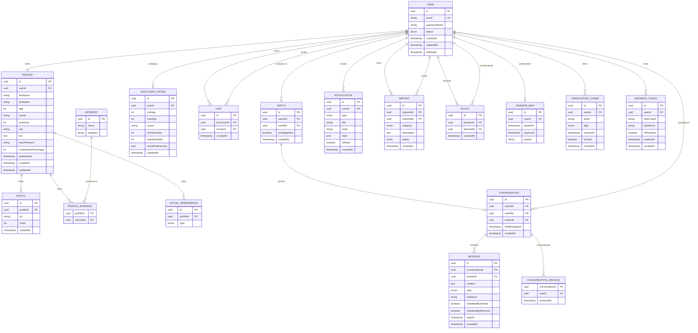

### 5.2 Enumeraciones del Dominio

```typescript
// Tipos de preferencias sociales
enum SocialPreferenceType {
  FRIENDSHIP = 'FRIENDSHIP',
  NETWORKING = 'NETWORKING',
  STUDY = 'STUDY',
  RELATIONSHIP = 'RELATIONSHIP',
  CASUAL_CONVERSATION = 'CASUAL_CONVERSATION',
}

// Categorías de intereses
enum InterestCategory {
  HOBBIES = 'HOBBIES',
  ACADEMIC = 'ACADEMIC',
  SPORTS = 'SPORTS',
  MUSIC = 'MUSIC',
  GAMING = 'GAMING',
  READING = 'READING',
  ENTREPRENEURSHIP = 'ENTREPRENEURSHIP',
  TECHNOLOGY = 'TECHNOLOGY',
  RESEARCH = 'RESEARCH',
  LANGUAGES = 'LANGUAGES',
}

// Tipos de mensaje
enum MessageType {
  TEXT = 'TEXT',
  IMAGE = 'IMAGE',
  EMOJI = 'EMOJI',
}

// Categorías de reporte
enum ReportCategory {
  INAPPROPRIATE_CONTENT = 'INAPPROPRIATE_CONTENT',
  HARASSMENT = 'HARASSMENT',
  SPAM = 'SPAM',
  FAKE_PROFILE = 'FAKE_PROFILE',
  OTHER = 'OTHER',
}

// Tipos de notificación
enum NotificationType {
  NEW_LIKE = 'NEW_LIKE',
  NEW_MATCH = 'NEW_MATCH',
  NEW_MESSAGE = 'NEW_MESSAGE',
  PROFILE_VISIT = 'PROFILE_VISIT',
}

// Estado del usuario
enum UserStatus {
  PENDING_VERIFICATION = 'PENDING_VERIFICATION',
  ACTIVE = 'ACTIVE',
  SUSPENDED = 'SUSPENDED',
  DELETED = 'DELETED',
}
```

---

## 6. Esquema de Base de Datos

### 6.1 Prisma Schema Completo

```prisma
// prisma/schema.prisma
generator client {
  provider = "prisma-client-js"
}

datasource db {
  provider = "postgresql"
  url      = env("DATABASE_URL")
}

// ─────────────────────────────────────────────
// AUTENTICACIÓN
// ─────────────────────────────────────────────

model User {
  id           String     @id @default(uuid())
  email        String     @unique
  passwordHash String     @map("password_hash")
  status       UserStatus @default(PENDING_VERIFICATION)
  createdAt    DateTime   @default(now()) @map("created_at")
  updatedAt    DateTime   @updatedAt @map("updated_at")
  deletedAt    DateTime?  @map("deleted_at")

  profile            Profile?
  discoveryFilter    DiscoveryFilter?
  likesGiven         Like[]             @relation("LikesGiven")
  likesReceived      Like[]             @relation("LikesReceived")
  matchesAsA         Match[]            @relation("MatchUserA")
  matchesAsB         Match[]            @relation("MatchUserB")
  conversationsAsA   Conversation[]     @relation("ConversationUserA")
  conversationsAsB   Conversation[]     @relation("ConversationUserB")
  messagesSent       Message[]
  notifications      Notification[]
  reportsGiven       Report[]           @relation("ReportsGiven")
  reportsReceived    Report[]           @relation("ReportsReceived")
  blocksGiven        Block[]            @relation("BlocksGiven")
  blocksReceived     Block[]            @relation("BlocksReceived")
  shadowBan          ShadowBan?
  verificationTokens VerificationToken[]
  refreshTokens      RefreshToken[]
  conversationArchives ConversationArchive[]

  @@index([email])
  @@index([status])
  @@index([deletedAt])
  @@map("users")
}

model VerificationToken {
  id        String                @id @default(uuid())
  userId    String                @map("user_id")
  token     String                @unique
  type      VerificationTokenType
  expiresAt DateTime              @map("expires_at")
  isUsed    Boolean               @default(false) @map("is_used")
  createdAt DateTime              @default(now()) @map("created_at")

  user User @relation(fields: [userId], references: [id], onDelete: Cascade)

  @@index([token])
  @@index([userId, type])
  @@map("verification_tokens")
}

model RefreshToken {
  id         String   @id @default(uuid())
  userId     String   @map("user_id")
  tokenHash  String   @unique @map("token_hash")
  ipAddress  String   @map("ip_address")
  isRevoked  Boolean  @default(false) @map("is_revoked")
  expiresAt  DateTime @map("expires_at")
  createdAt  DateTime @default(now()) @map("created_at")

  user User @relation(fields: [userId], references: [id], onDelete: Cascade)

  @@index([tokenHash])
  @@index([userId])
  @@map("refresh_tokens")
}

// ─────────────────────────────────────────────
// PERFIL
// ─────────────────────────────────────────────

model Profile {
  id                   String   @id @default(uuid())
  userId               String   @unique @map("user_id")
  firstName            String   @map("first_name")
  lastName             String   @map("last_name")
  age                  Int
  career               String
  semester             Int
  city                 String   @default("Bogotá")
  bio                  String?  @db.Text
  mainPhotoUrl         String?  @map("main_photo_url")
  completionPercentage Int      @default(0) @map("completion_percentage")
  lastActiveAt         DateTime @default(now()) @map("last_active_at")
  createdAt            DateTime @default(now()) @map("created_at")
  updatedAt            DateTime @updatedAt @map("updated_at")

  user              User               @relation(fields: [userId], references: [id], onDelete: Cascade)
  photos            Photo[]
  profileInterests  ProfileInterest[]
  socialPreferences SocialPreference[]

  @@index([career])
  @@index([semester])
  @@index([age])
  @@index([lastActiveAt])
  @@map("profiles")
}

model Photo {
  id        String   @id @default(uuid())
  profileId String   @map("profile_id")
  url       String
  order     Int
  createdAt DateTime @default(now()) @map("created_at")

  profile Profile @relation(fields: [profileId], references: [id], onDelete: Cascade)

  @@unique([profileId, order])
  @@index([profileId])
  @@map("photos")
}

model Interest {
  id       String           @id @default(uuid())
  name     String           @unique
  category InterestCategory

  profileInterests ProfileInterest[]

  @@index([category])
  @@map("interests")
}

model ProfileInterest {
  profileId  String @map("profile_id")
  interestId String @map("interest_id")

  profile  Profile  @relation(fields: [profileId], references: [id], onDelete: Cascade)
  interest Interest @relation(fields: [interestId], references: [id])

  @@id([profileId, interestId])
  @@map("profile_interests")
}

model SocialPreference {
  id        String               @id @default(uuid())
  profileId String               @map("profile_id")
  type      SocialPreferenceType

  profile Profile @relation(fields: [profileId], references: [id], onDelete: Cascade)

  @@unique([profileId, type])
  @@index([profileId])
  @@map("social_preferences")
}

// ─────────────────────────────────────────────
// DESCUBRIMIENTO
// ─────────────────────────────────────────────

model DiscoveryFilter {
  id                String   @id @default(uuid())
  userId            String   @unique @map("user_id")
  minAge            Int      @default(17) @map("min_age")
  maxAge            Int      @default(35) @map("max_age")
  career            String?
  minSemester       Int?     @map("min_semester")
  maxSemester       Int?     @map("max_semester")
  socialPreferences Json     @default("[]") @map("social_preferences")
  updatedAt         DateTime @updatedAt @map("updated_at")

  user User @relation(fields: [userId], references: [id], onDelete: Cascade)

  @@map("discovery_filters")
}

// ─────────────────────────────────────────────
// LIKES Y MATCHES
// ─────────────────────────────────────────────

model Like {
  id         String   @id @default(uuid())
  fromUserId String   @map("from_user_id")
  toUserId   String   @map("to_user_id")
  isIgnored  Boolean  @default(false) @map("is_ignored")
  createdAt  DateTime @default(now()) @map("created_at")

  fromUser User @relation("LikesGiven", fields: [fromUserId], references: [id], onDelete: Cascade)
  toUser   User @relation("LikesReceived", fields: [toUserId], references: [id], onDelete: Cascade)

  @@unique([fromUserId, toUserId])
  @@index([toUserId, isIgnored])
  @@index([fromUserId])
  @@map("likes")
}

model Match {
  id            String   @id @default(uuid())
  userAId       String   @map("user_a_id")
  userBId       String   @map("user_b_id")
  isHighlighted Boolean  @default(true) @map("is_highlighted")
  createdAt     DateTime @default(now()) @map("created_at")

  userA        User          @relation("MatchUserA", fields: [userAId], references: [id], onDelete: Cascade)
  userB        User          @relation("MatchUserB", fields: [userBId], references: [id], onDelete: Cascade)
  conversation Conversation?

  @@unique([userAId, userBId])
  @@index([userAId])
  @@index([userBId])
  @@map("matches")
}

// ─────────────────────────────────────────────
// CHAT
// ─────────────────────────────────────────────

model Conversation {
  id            String    @id @default(uuid())
  userAId       String    @map("user_a_id")
  userBId       String    @map("user_b_id")
  matchId       String?   @unique @map("match_id")
  lastMessageAt DateTime? @map("last_message_at")
  createdAt     DateTime  @default(now()) @map("created_at")

  userA    User                  @relation("ConversationUserA", fields: [userAId], references: [id], onDelete: Cascade)
  userB    User                  @relation("ConversationUserB", fields: [userBId], references: [id], onDelete: Cascade)
  match    Match?                @relation(fields: [matchId], references: [id])
  messages Message[]
  archives ConversationArchive[]

  @@unique([userAId, userBId])
  @@index([userAId, lastMessageAt])
  @@index([userBId, lastMessageAt])
  @@map("conversations")
}

model Message {
  id                 String      @id @default(uuid())
  conversationId     String      @map("conversation_id")
  senderId           String      @map("sender_id")
  content            String?     @db.Text
  type               MessageType @default(TEXT)
  mediaUrl           String?     @map("media_url")
  isDeletedBySender  Boolean     @default(false) @map("is_deleted_by_sender")
  isDeletedByReceiver Boolean    @default(false) @map("is_deleted_by_receiver")
  readAt             DateTime?   @map("read_at")
  createdAt          DateTime    @default(now()) @map("created_at")

  conversation Conversation @relation(fields: [conversationId], references: [id], onDelete: Cascade)
  sender       User         @relation(fields: [senderId], references: [id], onDelete: Cascade)

  @@index([conversationId, createdAt])
  @@index([senderId])
  @@map("messages")
}

model ConversationArchive {
  conversationId String   @map("conversation_id")
  userId         String   @map("user_id")
  archivedAt     DateTime @default(now()) @map("archived_at")

  conversation Conversation @relation(fields: [conversationId], references: [id], onDelete: Cascade)
  user         User         @relation(fields: [userId], references: [id], onDelete: Cascade)

  @@id([conversationId, userId])
  @@map("conversation_archives")
}

// ─────────────────────────────────────────────
// NOTIFICACIONES
// ─────────────────────────────────────────────

model Notification {
  id        String           @id @default(uuid())
  userId    String           @map("user_id")
  type      NotificationType
  title     String
  body      String
  data      Json             @default("{}")
  isRead    Boolean          @default(false) @map("is_read")
  createdAt DateTime         @default(now()) @map("created_at")

  user User @relation(fields: [userId], references: [id], onDelete: Cascade)

  @@index([userId, isRead])
  @@index([userId, createdAt])
  @@map("notifications")
}

// ─────────────────────────────────────────────
// MODERACIÓN
// ─────────────────────────────────────────────

model Report {
  id          String         @id @default(uuid())
  reporterId  String         @map("reporter_id")
  reportedId  String         @map("reported_id")
  category    ReportCategory
  description String?        @db.Text
  status      ReportStatus   @default(PENDING)
  createdAt   DateTime       @default(now()) @map("created_at")

  reporter User @relation("ReportsGiven", fields: [reporterId], references: [id], onDelete: Cascade)
  reported User @relation("ReportsReceived", fields: [reportedId], references: [id], onDelete: Cascade)

  @@index([reportedId, createdAt])
  @@index([status])
  @@map("reports")
}

model Block {
  id        String   @id @default(uuid())
  blockerId String   @map("blocker_id")
  blockedId String   @map("blocked_id")
  createdAt DateTime @default(now()) @map("created_at")

  blocker User @relation("BlocksGiven", fields: [blockerId], references: [id], onDelete: Cascade)
  blocked User @relation("BlocksReceived", fields: [blockedId], references: [id], onDelete: Cascade)

  @@unique([blockerId, blockedId])
  @@index([blockerId])
  @@index([blockedId])
  @@map("blocks")
}

model ShadowBan {
  id        String   @id @default(uuid())
  userId    String   @unique @map("user_id")
  startedAt DateTime @default(now()) @map("started_at")
  expiresAt DateTime @map("expires_at")
  reason    String

  user User @relation(fields: [userId], references: [id], onDelete: Cascade)

  @@index([expiresAt])
  @@map("shadow_bans")
}

// ─────────────────────────────────────────────
// ENUMS
// ─────────────────────────────────────────────

enum UserStatus {
  PENDING_VERIFICATION
  ACTIVE
  SUSPENDED
  DELETED
}

enum VerificationTokenType {
  EMAIL_VERIFICATION
  PASSWORD_RESET
}

enum InterestCategory {
  HOBBIES
  ACADEMIC
  SPORTS
  MUSIC
  GAMING
  READING
  ENTREPRENEURSHIP
  TECHNOLOGY
  RESEARCH
  LANGUAGES
}

enum SocialPreferenceType {
  FRIENDSHIP
  NETWORKING
  STUDY
  RELATIONSHIP
  CASUAL_CONVERSATION
}

enum MessageType {
  TEXT
  IMAGE
  EMOJI
}

enum NotificationType {
  NEW_LIKE
  NEW_MATCH
  NEW_MESSAGE
  PROFILE_VISIT
}

enum ReportCategory {
  INAPPROPRIATE_CONTENT
  HARASSMENT
  SPAM
  FAKE_PROFILE
  OTHER
}

enum ReportStatus {
  PENDING
  REVIEWED
  RESOLVED
  DISMISSED
}
```

### 6.2 Índices de Rendimiento Críticos

```sql
-- Índice compuesto para la cola de descubrimiento
CREATE INDEX idx_profiles_discovery 
ON profiles(career, semester, age, last_active_at DESC)
WHERE deleted_at IS NULL;

-- Índice para detección de match recíproco
CREATE INDEX idx_likes_mutual_check 
ON likes(to_user_id, from_user_id)
WHERE is_ignored = false;

-- Índice para mensajes paginados
CREATE INDEX idx_messages_pagination 
ON messages(conversation_id, created_at DESC)
WHERE is_deleted_by_sender = false AND is_deleted_by_receiver = false;

-- Índice para reportes recientes (shadow ban trigger)
CREATE INDEX idx_reports_recent 
ON reports(reported_id, created_at DESC)
WHERE status = 'PENDING';
```

---

## 7. Contratos de API

### 7.1 Convenciones Generales

- **Base URL:** `https://api.fescconnect.co/api/v1`
- **Autenticación:** `Authorization: Bearer <accessToken>` en todos los endpoints protegidos
- **Content-Type:** `application/json`
- **Respuesta de éxito:** `{ data: T, meta?: PaginationMeta }`
- **Respuesta de error:** `{ error: { code: string, message: string, details?: object } }`

### 7.2 Auth Endpoints

#### POST /auth/register
```typescript
// Request
{
  email: string;       // Debe terminar en @fesc.edu.co
  password: string;    // Min 8 chars, 1 mayúscula, 1 minúscula, 1 número
}

// Response 201
{
  data: {
    message: "Correo de verificación enviado a tu correo institucional";
    userId: string;
  }
}

// Errores
// 400: INVALID_EMAIL_DOMAIN | INVALID_PASSWORD | VALIDATION_ERROR
// 409: EMAIL_ALREADY_EXISTS
```

#### POST /auth/login
```typescript
// Request
{
  email: string;
  password: string;
}

// Response 200
{
  data: {
    accessToken: string;   // JWT, exp: 15min
    refreshToken: string;  // JWT, exp: 30d
    user: {
      id: string;
      email: string;
      hasCompletedOnboarding: boolean;
    }
  }
}

// Errores
// 401: INVALID_CREDENTIALS
// 403: ACCOUNT_NOT_VERIFIED | ACCOUNT_SUSPENDED
// 429: TOO_MANY_ATTEMPTS (bloqueo temporal 15min)
```

#### POST /auth/refresh
```typescript
// Request
{
  refreshToken: string;
}

// Response 200
{
  data: {
    accessToken: string;
    refreshToken: string;  // Nuevo token (rotación)
  }
}

// Errores
// 401: INVALID_REFRESH_TOKEN | REFRESH_TOKEN_REVOKED
```

#### POST /auth/logout
```typescript
// Headers: Authorization: Bearer <accessToken>
// Request
{
  refreshToken: string;
}

// Response 200
{
  data: { message: "Sesión cerrada exitosamente" }
}
```

#### POST /auth/verify-email
```typescript
// Request
{
  token: string;
}

// Response 200
{
  data: { message: "Correo verificado exitosamente" }
}

// Errores
// 400: INVALID_TOKEN | TOKEN_EXPIRED
```

#### POST /auth/forgot-password
```typescript
// Request
{
  email: string;
}

// Response 200 (siempre, para no revelar si el correo existe)
{
  data: { message: "Si el correo está registrado, recibirás instrucciones" }
}
```

#### POST /auth/reset-password
```typescript
// Request
{
  token: string;
  newPassword: string;
}

// Response 200
{
  data: { message: "Contraseña actualizada exitosamente" }
}

// Errores
// 400: INVALID_TOKEN | TOKEN_EXPIRED | TOKEN_ALREADY_USED | INVALID_PASSWORD
```

### 7.3 Profile Endpoints

#### GET /profiles/me
```typescript
// Response 200
{
  data: {
    id: string;
    userId: string;
    firstName: string;
    lastName: string;
    age: number;
    career: string;
    semester: number;
    city: string;
    bio: string | null;
    mainPhotoUrl: string | null;
    photos: Array<{ id: string; url: string; order: number }>;
    interests: Array<{ id: string; name: string; category: string }>;
    socialPreferences: string[];
    completionPercentage: number;
    lastActiveAt: string;
  }
}
```

#### PUT /profiles/me
```typescript
// Request (todos los campos opcionales)
{
  firstName?: string;
  lastName?: string;
  age?: number;          // 17-35
  career?: string;
  semester?: number;     // 1-10
  city?: string;
  bio?: string;          // Max 500 chars
  interests?: string[];  // Array de interestIds, max 15
  socialPreferences?: SocialPreferenceType[];
}

// Response 200
{
  data: ProfileResponse  // Perfil actualizado completo
}
```

#### POST /profiles/me/photos
```typescript
// Request: multipart/form-data
// Campo: photo (File, max 10MB, JPG/PNG/WEBP)
// Campo: order (number, 1-6)

// Response 201
{
  data: {
    id: string;
    url: string;
    order: number;
  }
}

// Errores
// 400: INVALID_FILE_TYPE | FILE_TOO_LARGE | MAX_PHOTOS_REACHED
```

#### GET /profiles/:userId
```typescript
// Response 200
{
  data: {
    id: string;
    firstName: string;
    lastName: string;
    age: number;
    career: string;
    semester: number;
    city: string;
    bio: string | null;
    mainPhotoUrl: string | null;
    photos: Array<{ id: string; url: string; order: number }>;
    interests: Array<{ id: string; name: string; category: string }>;
    socialPreferences: string[];
    compatibilityScore: number;  // 0-100
    isOnline: boolean;
  }
}

// Errores
// 404: PROFILE_NOT_FOUND
// 403: PROFILE_BLOCKED (si hay bloqueo mutuo)
```

### 7.4 Discovery Endpoints

#### GET /discovery/queue
```typescript
// Query params
// limit?: number (default: 10, max: 20)
// offset?: number (default: 0)

// Response 200
{
  data: {
    profiles: Array<{
      id: string;
      userId: string;
      firstName: string;
      age: number;
      career: string;
      semester: number;
      mainPhotoUrl: string;
      photos: Array<{ url: string; order: number }>;
      interests: Array<{ name: string; category: string }>;
      socialPreferences: string[];
      compatibilityScore: number;
      commonInterestsCount: number;
    }>;
    hasMore: boolean;
    total: number;
  }
}
```

#### GET /discovery/filters
```typescript
// Response 200
{
  data: {
    minAge: number;
    maxAge: number;
    career: string | null;
    minSemester: number | null;
    maxSemester: number | null;
    socialPreferences: string[];
  }
}
```

#### PUT /discovery/filters
```typescript
// Request
{
  minAge?: number;
  maxAge?: number;
  career?: string | null;
  minSemester?: number | null;
  maxSemester?: number | null;
  socialPreferences?: string[];
}

// Response 200
{
  data: DiscoveryFilterResponse
}
```

### 7.5 Match Endpoints

#### POST /matches/like/:targetUserId
```typescript
// Response 200
{
  data: {
    liked: true;
    matched: boolean;
    matchId: string | null;
    compatibilityScore: number | null;
  }
}
```

#### POST /matches/pass/:targetUserId
```typescript
// Response 200
{
  data: { passed: true }
}
```

#### GET /matches
```typescript
// Query: page?, limit? (default 20)
// Response 200
{
  data: {
    matches: Array<{
      id: string;
      user: ProfileSummary;
      compatibilityScore: number;
      isHighlighted: boolean;
      hasUnreadMessages: boolean;
      lastMessageAt: string | null;
      createdAt: string;
    }>;
  },
  meta: { page: number; limit: number; total: number; hasMore: boolean }
}
```

#### GET /matches/likes-received
```typescript
// Query: page?, limit? (default 20)
// Response 200
{
  data: {
    likes: Array<{
      id: string;
      fromUser: ProfileSummary;
      compatibilityScore: number;
      createdAt: string;
    }>;
  },
  meta: PaginationMeta
}
```

#### POST /matches/likes/:likeId/ignore
```typescript
// Response 200
{
  data: { ignored: true }
}
```

### 7.6 Chat Endpoints

#### GET /conversations
```typescript
// Query: page?, limit?, search? (búsqueda por nombre)
// Response 200
{
  data: {
    conversations: Array<{
      id: string;
      participant: ProfileSummary & { isOnline: boolean };
      lastMessage: { content: string; type: string; createdAt: string } | null;
      unreadCount: number;
      isArchived: boolean;
      isMatch: boolean;
      createdAt: string;
    }>;
  },
  meta: PaginationMeta
}
```

#### GET /conversations/:conversationId/messages
```typescript
// Query: before? (cursor ISO timestamp), limit? (default 50)
// Response 200
{
  data: {
    messages: Array<{
      id: string;
      senderId: string;
      content: string | null;
      type: MessageType;
      mediaUrl: string | null;
      readAt: string | null;
      createdAt: string;
    }>;
    hasMore: boolean;
  }
}
```

#### POST /conversations/:conversationId/messages
```typescript
// Request
{
  content?: string;   // Para TEXT y EMOJI
  type: MessageType;
}
// O multipart/form-data para IMAGE

// Response 201
{
  data: MessageResponse
}

// Errores
// 429: MESSAGE_RATE_LIMIT_EXCEEDED (50 msg/h sin match)
// 403: CONVERSATION_BLOCKED
```

#### POST /conversations/:conversationId/archive
```typescript
// Response 200
{
  data: { archived: true }
}
```

#### DELETE /conversations/:conversationId
```typescript
// Response 200
{
  data: { deleted: true }
}
// Solo elimina para el usuario que hace la petición
```

### 7.7 Notification Endpoints

#### GET /notifications
```typescript
// Query: page?, limit?, unreadOnly?
// Response 200
{
  data: {
    notifications: Array<{
      id: string;
      type: NotificationType;
      title: string;
      body: string;
      data: object;
      isRead: boolean;
      createdAt: string;
    }>;
  },
  meta: PaginationMeta
}
```

#### POST /notifications/register-token
```typescript
// Request
{
  expoPushToken: string;
}
// Response 200
{
  data: { registered: true }
}
```

### 7.8 Moderation Endpoints

#### POST /moderation/report
```typescript
// Request
{
  reportedUserId: string;
  category: ReportCategory;
  description?: string;  // Max 500 chars
}

// Response 201
{
  data: {
    reportId: string;
    message: "Reporte recibido. Lo revisaremos pronto.";
  }
}
```

#### POST /moderation/block/:targetUserId
```typescript
// Response 200
{
  data: { blocked: true }
}
```

#### DELETE /moderation/block/:targetUserId
```typescript
// Response 200
{
  data: { unblocked: true }
}
```

---

## 8. Arquitectura WebSocket

### 8.1 Configuración del Gateway NestJS

```typescript
// src/modules/chat/presentation/gateways/chat.gateway.ts
import {
  WebSocketGateway,
  WebSocketServer,
  SubscribeMessage,
  ConnectedSocket,
  MessageBody,
  OnGatewayConnection,
  OnGatewayDisconnect,
} from '@nestjs/websockets';
import { Server, Socket } from 'socket.io';
import { UseGuards } from '@nestjs/common';
import { WsJwtGuard } from '@/common/guards/ws-jwt.guard';

@WebSocketGateway({
  cors: { origin: '*', credentials: true },
  namespace: '/chat',
  transports: ['websocket'],
})
export class ChatGateway implements OnGatewayConnection, OnGatewayDisconnect {
  @WebSocketServer()
  server: Server;

  constructor(
    private readonly chatService: ChatService,
    private readonly onlineStatusService: OnlineStatusService,
  ) {}

  async handleConnection(client: Socket): Promise<void> {
    const userId = await this.authenticateSocket(client);
    if (!userId) {
      client.disconnect();
      return;
    }
    
    client.data.userId = userId;
    
    // Unirse a sala personal para recibir mensajes directos
    await client.join(`user:${userId}`);
    
    // Marcar como online en Redis
    await this.onlineStatusService.setOnline(userId);
    
    // Notificar a contactos del cambio de estado
    await this.broadcastOnlineStatus(userId, true);
  }

  async handleDisconnect(client: Socket): Promise<void> {
    const userId = client.data.userId;
    if (!userId) return;
    
    await this.onlineStatusService.setOffline(userId);
    await this.broadcastOnlineStatus(userId, false);
  }

  @UseGuards(WsJwtGuard)
  @SubscribeMessage('join_conversation')
  async handleJoinConversation(
    @ConnectedSocket() client: Socket,
    @MessageBody() data: { conversationId: string },
  ): Promise<void> {
    const { userId } = client.data;
    const hasAccess = await this.chatService.userHasAccessToConversation(
      userId,
      data.conversationId,
    );
    
    if (hasAccess) {
      await client.join(`conversation:${data.conversationId}`);
      // Marcar mensajes como leídos al unirse
      await this.chatService.markMessagesAsRead(data.conversationId, userId);
      this.server
        .to(`conversation:${data.conversationId}`)
        .emit('messages_read', { conversationId: data.conversationId, userId });
    }
  }

  @UseGuards(WsJwtGuard)
  @SubscribeMessage('send_message')
  async handleSendMessage(
    @ConnectedSocket() client: Socket,
    @MessageBody() data: SendMessageDto,
  ): Promise<void> {
    const { userId } = client.data;
    
    const message = await this.chatService.sendMessage({
      senderId: userId,
      conversationId: data.conversationId,
      content: data.content,
      type: data.type,
    });
    
    // Emitir a todos en la sala de la conversación
    this.server
      .to(`conversation:${data.conversationId}`)
      .emit('new_message', message);
    
    // Emitir a la sala personal del destinatario (para actualizar bandeja)
    const recipientId = await this.chatService.getConversationRecipient(
      data.conversationId,
      userId,
    );
    this.server
      .to(`user:${recipientId}`)
      .emit('conversation_updated', {
        conversationId: data.conversationId,
        lastMessage: message,
      });
  }

  @UseGuards(WsJwtGuard)
  @SubscribeMessage('typing_start')
  async handleTypingStart(
    @ConnectedSocket() client: Socket,
    @MessageBody() data: { conversationId: string },
  ): Promise<void> {
    client.to(`conversation:${data.conversationId}`).emit('typing_indicator', {
      conversationId: data.conversationId,
      userId: client.data.userId,
      isTyping: true,
    });
  }

  @UseGuards(WsJwtGuard)
  @SubscribeMessage('typing_stop')
  async handleTypingStop(
    @ConnectedSocket() client: Socket,
    @MessageBody() data: { conversationId: string },
  ): Promise<void> {
    client.to(`conversation:${data.conversationId}`).emit('typing_indicator', {
      conversationId: data.conversationId,
      userId: client.data.userId,
      isTyping: false,
    });
  }

  @UseGuards(WsJwtGuard)
  @SubscribeMessage('heartbeat')
  async handleHeartbeat(@ConnectedSocket() client: Socket): Promise<void> {
    await this.onlineStatusService.renewOnline(client.data.userId);
    client.emit('heartbeat_ack');
  }
}
```

### 8.2 Eventos WebSocket — Referencia Completa

#### Eventos del Cliente → Servidor

| Evento | Payload | Descripción |
|--------|---------|-------------|
| `join_conversation` | `{ conversationId: string }` | Unirse a sala de conversación |
| `leave_conversation` | `{ conversationId: string }` | Salir de sala de conversación |
| `send_message` | `{ conversationId, content, type }` | Enviar mensaje de texto |
| `typing_start` | `{ conversationId: string }` | Iniciar indicador de escritura |
| `typing_stop` | `{ conversationId: string }` | Detener indicador de escritura |
| `heartbeat` | `{}` | Mantener estado online activo |

#### Eventos del Servidor → Cliente

| Evento | Payload | Descripción |
|--------|---------|-------------|
| `new_message` | `MessageResponse` | Nuevo mensaje recibido |
| `messages_read` | `{ conversationId, userId }` | Mensajes marcados como leídos |
| `typing_indicator` | `{ conversationId, userId, isTyping }` | Estado de escritura del otro usuario |
| `online_status_changed` | `{ userId, isOnline }` | Cambio de estado online/offline |
| `conversation_updated` | `{ conversationId, lastMessage }` | Actualización de bandeja de entrada |
| `match_created` | `{ matchId, userId, compatibilityScore }` | Nuevo match creado |
| `heartbeat_ack` | `{}` | Confirmación de heartbeat |

### 8.3 Cliente WebSocket en React Native

```typescript
// src/services/socket/socketClient.ts
import { io, Socket } from 'socket.io-client';
import { useAuthStore } from '@/features/auth/store/authStore';

class SocketClient {
  private socket: Socket | null = null;
  private readonly url = process.env.EXPO_PUBLIC_WS_URL ?? 'wss://api.fescconnect.co';

  connect(): void {
    const { accessToken } = useAuthStore.getState();
    if (!accessToken || this.socket?.connected) return;

    this.socket = io(`${this.url}/chat`, {
      auth: { token: accessToken },
      transports: ['websocket'],
      reconnection: true,
      reconnectionAttempts: 5,
      reconnectionDelay: 1000,
    });

    this.socket.on('connect', () => {
      console.log('[Socket] Conectado');
      this.startHeartbeat();
    });

    this.socket.on('disconnect', (reason) => {
      console.log('[Socket] Desconectado:', reason);
      this.stopHeartbeat();
    });
  }

  private heartbeatInterval: ReturnType<typeof setInterval> | null = null;

  private startHeartbeat(): void {
    this.heartbeatInterval = setInterval(() => {
      this.socket?.emit('heartbeat');
    }, 20_000); // Cada 20 segundos
  }

  private stopHeartbeat(): void {
    if (this.heartbeatInterval) {
      clearInterval(this.heartbeatInterval);
      this.heartbeatInterval = null;
    }
  }

  disconnect(): void {
    this.stopHeartbeat();
    this.socket?.disconnect();
    this.socket = null;
  }

  emit(event: string, data?: unknown): void {
    this.socket?.emit(event, data);
  }

  on(event: string, callback: (...args: unknown[]) => void): void {
    this.socket?.on(event, callback);
  }

  off(event: string, callback?: (...args: unknown[]) => void): void {
    this.socket?.off(event, callback);
  }

  get isConnected(): boolean {
    return this.socket?.connected ?? false;
  }
}

export const socketClient = new SocketClient();
```

### 8.4 Diagrama de Flujo WebSocket

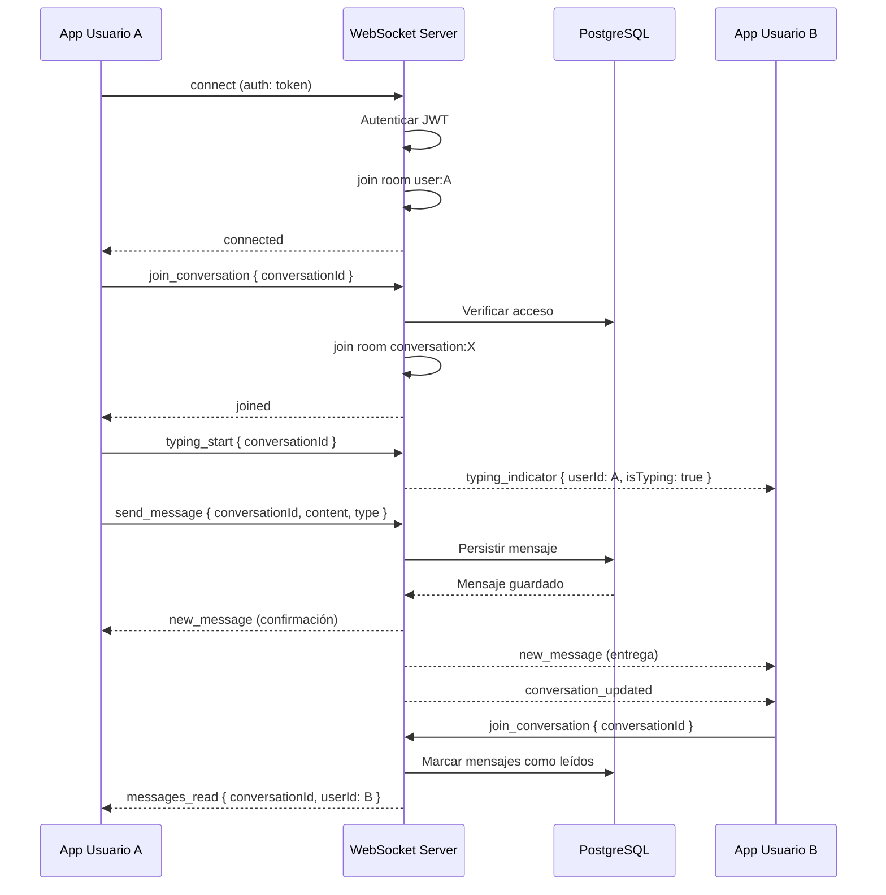

---

## 9. Algoritmo Score de Compatibilidad

### 9.1 Fórmula General

El Score_de_Compatibilidad es un valor entero en el rango [0, 100] calculado como la suma ponderada de cinco factores:

```
Score(A, B) = round(
  W_interests  * F_interests(A, B)  +
  W_career     * F_career(A, B)     +
  W_semester   * F_semester(A, B)   +
  W_social     * F_social(A, B)     +
  W_activity   * F_activity(B)
)
```

Donde los pesos suman 1.0:

| Factor | Peso (W) | Descripción |
|--------|----------|-------------|
| Intereses en común | 0.35 | Porcentaje de intereses compartidos |
| Compatibilidad de carrera | 0.20 | Misma carrera o área afín |
| Proximidad de semestre | 0.15 | Diferencia de semestres |
| Preferencias sociales | 0.20 | Objetivos sociales compatibles |
| Actividad reciente | 0.10 | Qué tan activo está el perfil sugerido |

### 9.2 Funciones de Factor

#### F_interests(A, B) — Intereses en Común

```typescript
function calculateInterestScore(
  interestsA: string[],
  interestsB: string[],
): number {
  if (interestsA.length === 0 || interestsB.length === 0) return 0;
  
  const setA = new Set(interestsA);
  const setB = new Set(interestsB);
  const intersection = [...setA].filter((i) => setB.has(i));
  const union = new Set([...setA, ...setB]);
  
  // Jaccard similarity: |A ∩ B| / |A ∪ B|
  return intersection.length / union.size; // [0, 1]
}
```

#### F_career(A, B) — Compatibilidad de Carrera

```typescript
// Mapa de afinidad entre carreras (definido por administradores)
const CAREER_AFFINITY: Record<string, string[]> = {
  'Ingeniería de Sistemas': ['Ingeniería Electrónica', 'Ingeniería Industrial', 'Administración'],
  'Administración de Empresas': ['Contaduría', 'Economía', 'Ingeniería Industrial'],
  // ... más carreras
};

function calculateCareerScore(careerA: string, careerB: string): number {
  if (careerA === careerB) return 1.0;
  
  const affinityA = CAREER_AFFINITY[careerA] ?? [];
  const affinityB = CAREER_AFFINITY[careerB] ?? [];
  
  if (affinityA.includes(careerB) || affinityB.includes(careerA)) return 0.6;
  
  return 0.2; // Carreras sin afinidad definida
}
```

#### F_semester(A, B) — Proximidad de Semestre

```typescript
function calculateSemesterScore(semesterA: number, semesterB: number): number {
  const diff = Math.abs(semesterA - semesterB);
  // Diferencia 0 → 1.0, diferencia 1 → 0.8, diferencia 2 → 0.6, etc.
  // Diferencia >= 5 → 0.0
  return Math.max(0, 1.0 - diff * 0.2);
}
```

#### F_social(A, B) — Preferencias Sociales Compatibles

```typescript
function calculateSocialScore(
  prefsA: SocialPreferenceType[],
  prefsB: SocialPreferenceType[],
): number {
  if (prefsA.length === 0 || prefsB.length === 0) return 0.5; // Neutral si no hay preferencias
  
  const setA = new Set(prefsA);
  const setB = new Set(prefsB);
  const intersection = [...setA].filter((p) => setB.has(p));
  
  // Al menos una preferencia en común → score proporcional
  return intersection.length / Math.max(setA.size, setB.size); // [0, 1]
}
```

#### F_activity(B) — Actividad Reciente del Perfil Sugerido

```typescript
function calculateActivityScore(lastActiveAt: Date): number {
  const hoursAgo = (Date.now() - lastActiveAt.getTime()) / (1000 * 60 * 60);
  
  if (hoursAgo <= 1)   return 1.0;   // Activo en la última hora
  if (hoursAgo <= 24)  return 0.8;   // Activo hoy
  if (hoursAgo <= 72)  return 0.5;   // Activo en los últimos 3 días
  if (hoursAgo <= 168) return 0.3;   // Activo en la última semana
  return 0.1;                         // Inactivo por más de una semana
}
```

### 9.3 Implementación Completa

```typescript
// src/modules/recommendation/domain/services/compatibility.domain-service.ts

export interface CompatibilityInput {
  userA: {
    interests: string[];
    career: string;
    semester: number;
    socialPreferences: SocialPreferenceType[];
  };
  userB: {
    interests: string[];
    career: string;
    semester: number;
    socialPreferences: SocialPreferenceType[];
    lastActiveAt: Date;
  };
}

const WEIGHTS = {
  interests: 0.35,
  career: 0.20,
  semester: 0.15,
  social: 0.20,
  activity: 0.10,
} as const;

export class CompatibilityDomainService {
  calculateScore(input: CompatibilityInput): number {
    const { userA, userB } = input;

    const rawScore =
      WEIGHTS.interests * calculateInterestScore(userA.interests, userB.interests) +
      WEIGHTS.career    * calculateCareerScore(userA.career, userB.career) +
      WEIGHTS.semester  * calculateSemesterScore(userA.semester, userB.semester) +
      WEIGHTS.social    * calculateSocialScore(userA.socialPreferences, userB.socialPreferences) +
      WEIGHTS.activity  * calculateActivityScore(userB.lastActiveAt);

    // Garantizar rango [0, 100] entero
    return Math.round(Math.min(100, Math.max(0, rawScore * 100)));
  }
}
```

### 9.4 Propiedad de Simetría

La simetría del score se garantiza porque los factores que dependen de ambos usuarios (intereses, carrera, semestre, preferencias sociales) son funciones simétricas. El único factor asimétrico es `F_activity`, que depende únicamente del perfil **sugerido** (B). Para garantizar simetría completa, el score se calcula siempre desde la perspectiva del usuario que consulta:

```
score(A consulta B) = f(A, B) donde F_activity usa lastActiveAt de B
score(B consulta A) = f(B, A) donde F_activity usa lastActiveAt de A
```

Esto cumple el Requirement 10.5 porque el cálculo es determinista dado el mismo par de perfiles en el mismo momento.

### 9.5 Caché del Score

```typescript
// El score se cachea en Redis con TTL de 6 horas
// Key: score:{minUserId}:{maxUserId} (orden canónico para garantizar simetría)
const cacheKey = `score:${[userAId, userBId].sort().join(':')}`;
```

### 9.6 Diagrama del Algoritmo

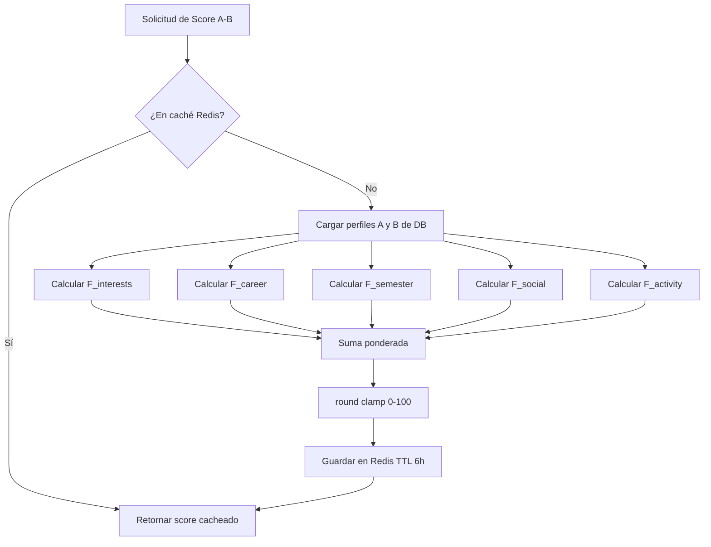

---

## 10. Flujos de Usuario Clave

### 10.1 Auth Flow

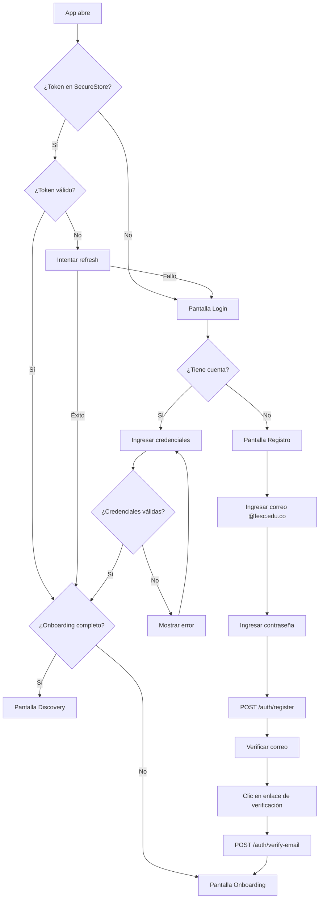

### 10.2 Onboarding Flow

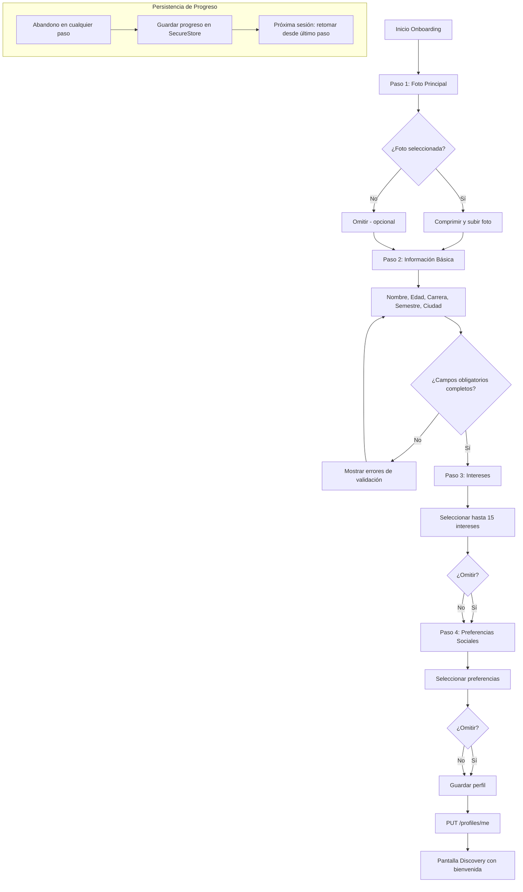

### 10.3 Discovery Flow

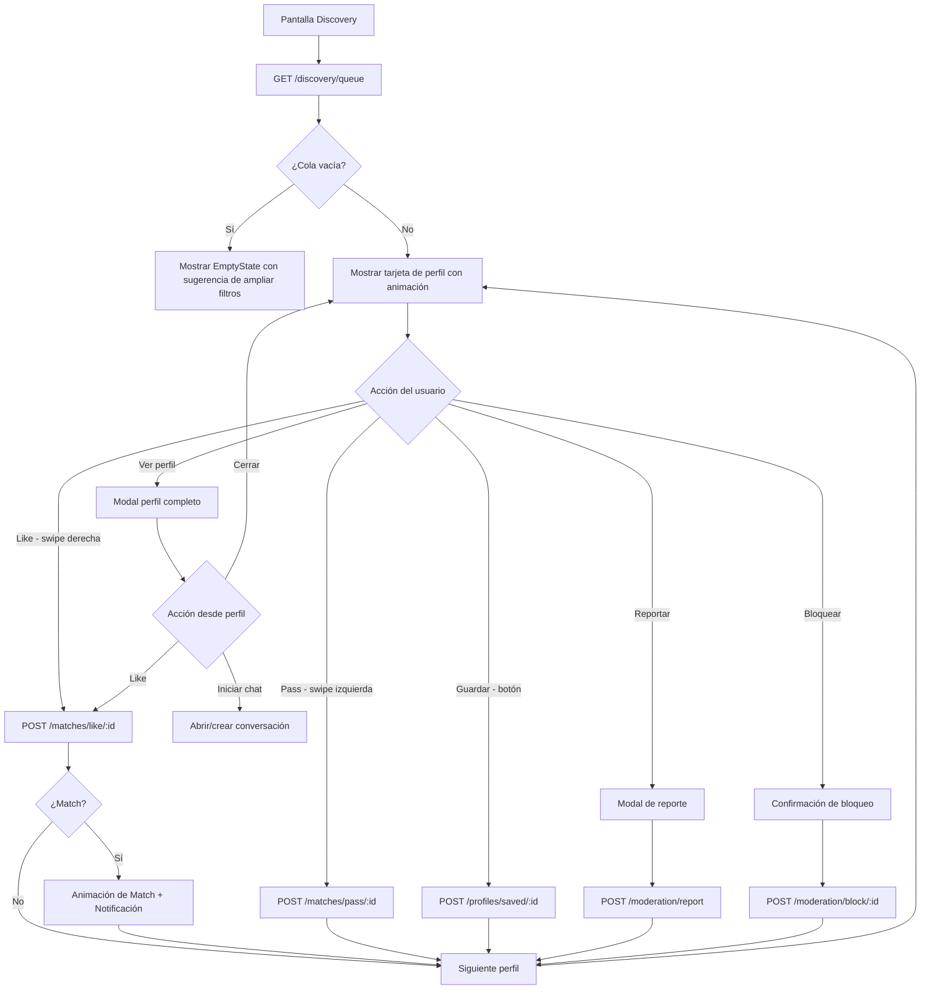

### 10.4 Chat Flow

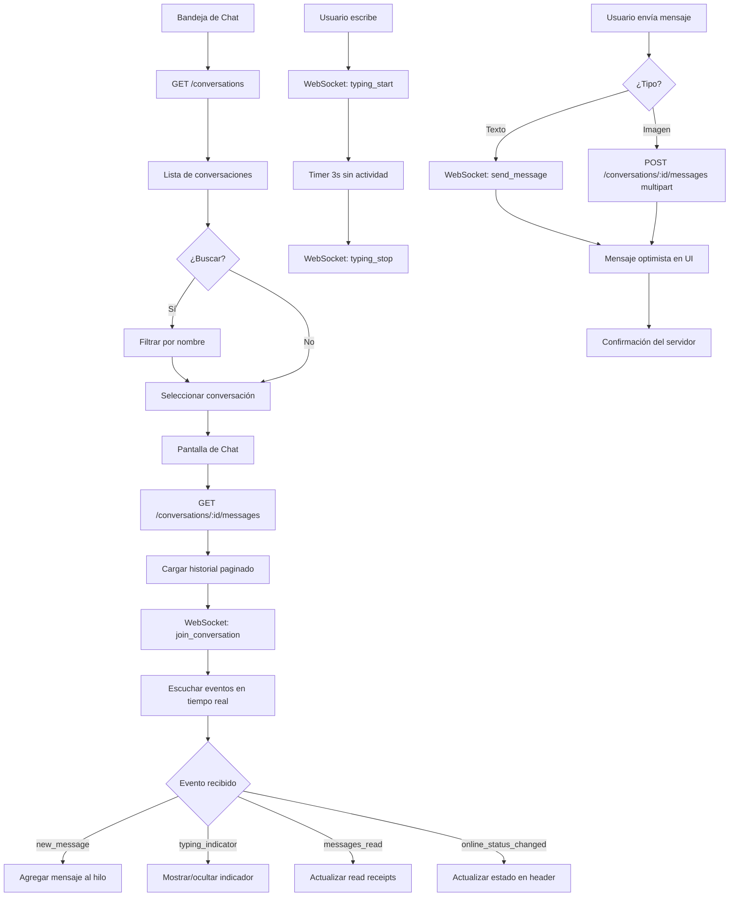

---

## 11. Decisiones de Arquitectura (ADRs)

### ADR-001: React Native + Expo como Framework Mobile

**Estado:** Aceptado  
**Contexto:** Se necesita una app mobile que funcione en iOS y Android con un equipo de desarrollo pequeño.

**Decisión:** Usar React Native con Expo SDK (última versión estable).

**Justificación:**
- Expo simplifica el ciclo de desarrollo (OTA updates, builds en la nube, APIs nativas unificadas)
- Expo Router proporciona navegación basada en archivos similar a Next.js, reduciendo la curva de aprendizaje
- TypeScript estricto garantiza type safety en toda la app
- Expo Secure Store, Notifications, Image Picker son APIs nativas probadas y mantenidas

**Consecuencias:** Dependencia del ecosistema Expo. Limitaciones en módulos nativos muy específicos (mitigado con Expo Modules API).

---

### ADR-002: NestJS con Clean Architecture + DDD

**Estado:** Aceptado  
**Contexto:** Se necesita un backend escalable, testeable y mantenible a largo plazo.

**Decisión:** NestJS con Clean Architecture (4 capas) y principios DDD.

**Justificación:**
- NestJS proporciona inyección de dependencias, decoradores y módulos que se alinean naturalmente con Clean Architecture
- La separación en capas (Presentation → Application → Domain → Infrastructure) permite cambiar implementaciones sin afectar la lógica de negocio
- DDD con Value Objects garantiza invariantes del dominio (ej: Email solo acepta @fesc.edu.co)
- Preparado para extraer módulos como microservicios en el futuro

**Consecuencias:** Mayor verbosidad inicial. Curva de aprendizaje para el equipo. Compensado por mantenibilidad a largo plazo.

---

### ADR-003: PostgreSQL + Prisma ORM

**Estado:** Aceptado  
**Contexto:** Se necesita una base de datos relacional con soporte para consultas complejas (discovery, scores).

**Decisión:** PostgreSQL 16 con Prisma ORM.

**Justificación:**
- PostgreSQL soporta índices compuestos, full-text search y JSON nativo necesarios para el discovery engine
- Prisma genera tipos TypeScript automáticamente, eliminando discrepancias entre DB y código
- Prisma Migrate gestiona migraciones de forma declarativa
- Soft deletes implementados con `deletedAt` para cumplir requisitos de privacidad (GDPR-like)

**Consecuencias:** Prisma no soporta todas las features avanzadas de PostgreSQL (ej: triggers). Se usarán migraciones SQL raw cuando sea necesario.

---

### ADR-004: Redis para Caché y Estado en Tiempo Real

**Estado:** Aceptado  
**Contexto:** La cola de discovery y el estado online de usuarios requieren acceso de baja latencia.

**Decisión:** Redis 7 para caché de discovery queue, scores de compatibilidad, estado online y rate limiting.

**Justificación:**
- La cola de discovery es costosa de calcular (múltiples JOINs + scoring). Cachearla en Redis reduce la carga en PostgreSQL
- El estado online requiere TTL automático (si el usuario no hace heartbeat, expira en 30s)
- Rate limiting distribuido requiere un store compartido entre instancias del servidor
- Redis Sorted Sets son ideales para mantener colas ordenadas por score

**Consecuencias:** Dependencia adicional de infraestructura. Necesidad de gestionar invalidación de caché.

---

### ADR-005: Socket.io para WebSocket

**Estado:** Aceptado  
**Contexto:** El chat en tiempo real requiere comunicación bidireccional con soporte para reconexión automática.

**Decisión:** Socket.io con namespace `/chat`.

**Justificación:**
- Socket.io maneja automáticamente la reconexión, fallback a long-polling y rooms
- NestJS tiene integración nativa con Socket.io via `@WebSocketGateway`
- El sistema de rooms de Socket.io es ideal para conversaciones (cada conversación es una room)
- Soporte nativo en React Native via `socket.io-client`

**Consecuencias:** Para escalar horizontalmente, se necesita Redis Adapter para Socket.io (compartir estado entre instancias). Incluido en el roadmap post-MVP.

---

### ADR-006: Zustand + TanStack Query para Estado Frontend

**Estado:** Aceptado  
**Contexto:** Se necesita gestión de estado para datos del servidor y estado local de la UI.

**Decisión:** TanStack Query para estado del servidor, Zustand para estado local/global de UI.

**Justificación:**
- TanStack Query maneja automáticamente caché, revalidación, paginación infinita y optimistic updates para datos del servidor
- Zustand es minimalista y no requiere boilerplate (vs Redux). Ideal para estado de UI (auth, tema, filtros activos)
- La combinación evita duplicar datos del servidor en el store local
- Ambas librerías tienen excelente soporte para React Native

**Consecuencias:** Dos sistemas de estado que el equipo debe entender. Regla clara: datos del servidor → TanStack Query, estado de UI → Zustand.

---

### ADR-007: Argon2id para Hashing de Contraseñas

**Estado:** Aceptado  
**Contexto:** Las contraseñas deben almacenarse de forma segura.

**Decisión:** Argon2id con parámetros: memory=65536 KB, iterations=3, parallelism=4.

**Justificación:**
- Argon2id es el ganador del Password Hashing Competition (2015) y la recomendación actual de OWASP
- Resistente a ataques de GPU y ASIC (memory-hard)
- Parámetros configurados para ~300ms de tiempo de hash en hardware moderno (balance seguridad/UX)
- Disponible en Node.js via `argon2` package

**Consecuencias:** Mayor tiempo de CPU en login/registro vs bcrypt. Aceptable dado el contexto.

---

### ADR-008: Chat sin Match Previo

**Estado:** Aceptado  
**Contexto:** Diferenciador clave del producto vs Tinder/Bumble.

**Decisión:** Cualquier usuario puede iniciar conversación con otro sin match previo. El match solo desbloquea Conexión_Destacada.

**Justificación:**
- Reduce la fricción para networking académico y búsqueda de compañeros de estudio
- El contexto universitario (todos son estudiantes verificados de la misma institución) reduce el riesgo de acoso vs apps de citas genéricas
- El rate limiting (50 msg/h sin match) previene spam sin bloquear conversaciones legítimas

**Consecuencias:** Mayor riesgo de mensajes no deseados. Mitigado con rate limiting, reportes y shadow moderation.

---

## 12. Correctness Properties

*Una propiedad es una característica o comportamiento que debe ser verdadero en todas las ejecuciones válidas de un sistema — esencialmente, una declaración formal sobre lo que el sistema debe hacer. Las propiedades sirven como puente entre las especificaciones legibles por humanos y las garantías de corrección verificables por máquinas.*

### Reflexión sobre Propiedades (Property Reflection)

Antes de listar las propiedades finales, se realiza una revisión para eliminar redundancias:

- **P1 (validación de dominio de correo)** y **P2 (registro con correo válido)** son complementarias, no redundantes: P1 verifica el rechazo, P2 verifica la aceptación.
- **P3 (validación de contraseña)** es independiente de P1 y P2.
- **P4 (rotación de tokens)** es independiente de las propiedades de registro.
- **P5 (validación de fotos)** y **P6 (límite de intereses)** son propiedades de validación de perfil independientes. Se pueden combinar en una sola propiedad de "invariantes de perfil".
- **P7 (bloqueo oculta perfiles)** y **P8 (exclusiones de discovery)** se solapan parcialmente. P8 es más general e incluye el caso de bloqueo. Se consolidan.
- **P9 (score refleja afinidad)**, **P10 (rango del score)** y **P11 (simetría del score)** son propiedades distintas del mismo algoritmo. Se mantienen separadas por su importancia.
- **P12 (paginación de mensajes)** es independiente.
- **P13 (shadow ban por umbral)** y **P14 (rate limiting de mensajes)** son propiedades de moderación independientes.
- **P15 (autenticación en endpoints)** es una propiedad de seguridad transversal.
- **P16 (persistencia de onboarding)** es independiente.

**Resultado:** Se consolidan P5 y P6 en una sola propiedad de invariantes de perfil. P7 se absorbe en P8. Total: **13 propiedades finales**.

---

### Property 1: Rechazo de Correos No Institucionales

*Para cualquier* string de correo electrónico que no termine en `@fesc.edu.co`, el validador de dominio del Auth_Service SHALL rechazarlo y retornar un error `INVALID_EMAIL_DOMAIN`.

**Validates: Requirements 1.1**

---

### Property 2: Registro con Correo Institucional Válido

*Para cualquier* correo con formato válido que termine en `@fesc.edu.co` y cualquier contraseña que cumpla los requisitos mínimos de seguridad, el Auth_Service SHALL crear la cuenta en estado `PENDING_VERIFICATION`.

**Validates: Requirements 1.2**

---

### Property 3: Validación de Contraseña

*Para cualquier* string de contraseña, el validador SHALL aceptarla si y solo si tiene al menos 8 caracteres, contiene al menos una letra mayúscula, al menos una letra minúscula y al menos un dígito numérico. Cualquier string que viole alguna de estas condiciones SHALL ser rechazado.

**Validates: Requirements 1.5**

---

### Property 4: Rotación de Tokens de Refresco

*Para cualquier* token de refresco válido y no revocado, al usarlo para obtener nuevos tokens, el sistema SHALL emitir un nuevo par (accessToken, refreshToken) donde el nuevo refreshToken es diferente al original, y el token original queda revocado.

**Validates: Requirements 2.2**

---

### Property 5: Invariantes de Validación de Perfil

*Para cualquier* intento de actualización de perfil, el sistema SHALL rechazar la operación si: (a) se intenta agregar más de 6 fotos al perfil, (b) alguna foto supera 10 MB o no es de formato JPG/PNG/WEBP, o (c) se seleccionan más de 15 intereses simultáneamente. El perfil SHALL permanecer sin cambios ante cualquier violación de estas reglas.

**Validates: Requirements 4.2, 4.4**

---

### Property 6: Exclusiones de la Cola de Descubrimiento

*Para cualquier* usuario y cualquier cola de descubrimiento generada para ese usuario, la cola SHALL no contener: el propio usuario, usuarios que el usuario ha bloqueado, usuarios que han bloqueado al usuario, ni usuarios que el usuario ya vio en las últimas 24 horas.

**Validates: Requirements 5.3, 6.2**

---

### Property 7: Rango del Score de Compatibilidad

*Para cualquier* par de perfiles de usuario con cualquier combinación de atributos (intereses, carrera, semestre, preferencias sociales, fecha de última actividad), el Score_de_Compatibilidad calculado SHALL ser un entero en el rango [0, 100] inclusive.

**Validates: Requirements 10.4**

---

### Property 8: Simetría del Score de Compatibilidad

*Para cualquier* par de usuarios (A, B) con perfiles completos, el Score_de_Compatibilidad calculado desde la perspectiva de A hacia B SHALL ser igual al Score_de_Compatibilidad calculado desde la perspectiva de B hacia A, cuando ambos cálculos se realizan en el mismo instante de tiempo.

**Validates: Requirements 10.5**

---

### Property 9: Monotonicidad del Score por Intereses

*Para cualquier* par de perfiles (A, B), si se incrementa el número de intereses en común entre A y B (manteniendo todos los demás atributos constantes), el Score_de_Compatibilidad SHALL ser mayor o igual al score original.

**Validates: Requirements 6.8, 10.1**

---

### Property 10: Paginación Correcta de Mensajes

*Para cualquier* conversación con N mensajes y cualquier tamaño de página P (1 ≤ P ≤ 50), la paginación SHALL retornar exactamente los mensajes correctos en orden cronológico ascendente, sin duplicados ni omisiones, y el número total de mensajes retornados en todas las páginas SHALL ser igual a N.

**Validates: Requirements 9.9**

---

### Property 11: Umbral de Shadow Ban

*Para cualquier* usuario, el sistema SHALL aplicar shadow moderation si y solo si ese usuario ha acumulado 5 o más reportes en un período de 7 días. Con menos de 5 reportes en 7 días, el usuario SHALL mantener visibilidad normal en el Discovery_Engine.

**Validates: Requirements 12.3**

---

### Property 12: Rate Limiting de Mensajes sin Match

*Para cualquier* usuario que no tiene match con el destinatario, el sistema SHALL permitir el envío de hasta 50 mensajes por hora y SHALL rechazar con error `MESSAGE_RATE_LIMIT_EXCEEDED` cualquier mensaje adicional dentro de esa misma hora. Al inicio de una nueva hora, el contador SHALL reiniciarse a 0.

**Validates: Requirements 12.4**

---

### Property 13: Autenticación en Endpoints Protegidos

*Para cualquier* endpoint de la API que exponga o modifique datos de usuarios, una petición HTTP realizada sin token de acceso válido (ausente, malformado o expirado) SHALL retornar HTTP 401 y no SHALL ejecutar ninguna operación sobre los datos.

**Validates: Requirements 13.1**

---

### Property 14: Persistencia del Progreso de Onboarding

*Para cualquier* usuario que abandona el onboarding en cualquier paso (1 a 4), al retomar la sesión, el sistema SHALL presentar al usuario exactamente el paso siguiente al último completado, con todos los datos previamente ingresados preservados.

**Validates: Requirements 15.5**

---

## 13. Estrategia de Testing

### 13.1 Visión General

FESC Connect adopta una estrategia de testing en capas que combina pruebas unitarias, de propiedad, de integración y end-to-end para garantizar corrección en todos los niveles.

```
                    ┌─────────────────────┐
                    │   E2E Tests (Detox)  │  ← Flujos completos de usuario
                    └─────────────────────┘
                  ┌───────────────────────────┐
                  │  Integration Tests (Jest)  │  ← Módulos + DB + Redis
                  └───────────────────────────┘
              ┌─────────────────────────────────────┐
              │  Property-Based Tests (fast-check)   │  ← Propiedades universales
              └─────────────────────────────────────┘
          ┌─────────────────────────────────────────────┐
          │         Unit Tests (Jest + Vitest)           │  ← Funciones puras, dominio
          └─────────────────────────────────────────────┘
```

### 13.2 Testing Backend (NestJS)

#### Herramientas
- **Jest** — Test runner principal
- **fast-check** — Property-based testing (mínimo 100 iteraciones por propiedad)
- **@nestjs/testing** — TestingModule para tests de integración
- **Prisma Client Mock** — `jest-mock-extended` para mockear repositorios
- **Supertest** — Tests de integración HTTP

#### Tests Unitarios — Dominio

```typescript
// src/modules/auth/domain/value-objects/__tests__/email.vo.spec.ts
import { Email } from '../email.vo';

describe('Email Value Object', () => {
  describe('create', () => {
    it('acepta correos @fesc.edu.co válidos', () => {
      expect(() => Email.create('estudiante@fesc.edu.co')).not.toThrow();
    });

    it('rechaza correos sin dominio institucional', () => {
      expect(() => Email.create('usuario@gmail.com')).toThrow('INVALID_EMAIL_DOMAIN');
      expect(() => Email.create('usuario@fesc.com')).toThrow('INVALID_EMAIL_DOMAIN');
      expect(() => Email.create('usuario@edu.co')).toThrow('INVALID_EMAIL_DOMAIN');
    });

    it('normaliza a minúsculas', () => {
      const email = Email.create('ESTUDIANTE@FESC.EDU.CO');
      expect(email.value).toBe('estudiante@fesc.edu.co');
    });
  });
});
```

#### Tests de Propiedad — Algoritmo de Compatibilidad

```typescript
// src/modules/recommendation/domain/services/__tests__/compatibility.property.spec.ts
// Feature: fesc-connect, Property 7: Rango del Score de Compatibilidad
// Feature: fesc-connect, Property 8: Simetría del Score de Compatibilidad
// Feature: fesc-connect, Property 9: Monotonicidad del Score por Intereses

import * as fc from 'fast-check';
import { CompatibilityDomainService } from '../compatibility.domain-service';
import { SocialPreferenceType } from '@/types';

const service = new CompatibilityDomainService();

// Arbitrario para generar perfiles aleatorios
const profileArb = fc.record({
  interests: fc.array(fc.uuid(), { minLength: 0, maxLength: 15 }),
  career: fc.constantFrom('Ingeniería de Sistemas', 'Administración', 'Contaduría', 'Derecho'),
  semester: fc.integer({ min: 1, max: 10 }),
  socialPreferences: fc.array(
    fc.constantFrom(...Object.values(SocialPreferenceType)),
    { minLength: 0, maxLength: 5 }
  ),
  lastActiveAt: fc.date({ min: new Date('2024-01-01'), max: new Date() }),
});

describe('CompatibilityDomainService — Property Tests', () => {
  // Feature: fesc-connect, Property 7: Rango del Score de Compatibilidad
  it('el score siempre está en el rango [0, 100]', () => {
    fc.assert(
      fc.property(profileArb, profileArb, (profileA, profileB) => {
        const score = service.calculateScore({ userA: profileA, userB: profileB });
        return score >= 0 && score <= 100 && Number.isInteger(score);
      }),
      { numRuns: 200 }
    );
  });

  // Feature: fesc-connect, Property 8: Simetría del Score de Compatibilidad
  it('el score es simétrico: score(A,B) === score(B,A) en el mismo instante', () => {
    fc.assert(
      fc.property(profileArb, profileArb, (profileA, profileB) => {
        // Para garantizar simetría, usamos la misma fecha de actividad
        const fixedDate = new Date();
        const pA = { ...profileA, lastActiveAt: fixedDate };
        const pB = { ...profileB, lastActiveAt: fixedDate };
        
        const scoreAB = service.calculateScore({ userA: pA, userB: pB });
        const scoreBA = service.calculateScore({ userA: pB, userB: pA });
        
        return scoreAB === scoreBA;
      }),
      { numRuns: 200 }
    );
  });

  // Feature: fesc-connect, Property 9: Monotonicidad del Score por Intereses
  it('más intereses en común produce score mayor o igual', () => {
    fc.assert(
      fc.property(
        profileArb,
        profileArb,
        fc.array(fc.uuid(), { minLength: 1, maxLength: 5 }),
        (profileA, profileB, extraCommonInterests) => {
          const baseScore = service.calculateScore({ userA: profileA, userB: profileB });
          
          // Agregar intereses en común a ambos perfiles
          const enhancedA = {
            ...profileA,
            interests: [...new Set([...profileA.interests, ...extraCommonInterests])].slice(0, 15),
          };
          const enhancedB = {
            ...profileB,
            interests: [...new Set([...profileB.interests, ...extraCommonInterests])].slice(0, 15),
          };
          
          const enhancedScore = service.calculateScore({ userA: enhancedA, userB: enhancedB });
          
          return enhancedScore >= baseScore;
        }
      ),
      { numRuns: 200 }
    );
  });
});
```

#### Tests de Propiedad — Validación de Email

```typescript
// src/modules/auth/domain/value-objects/__tests__/email.property.spec.ts
// Feature: fesc-connect, Property 1: Rechazo de Correos No Institucionales
// Feature: fesc-connect, Property 2: Registro con Correo Institucional Válido

import * as fc from 'fast-check';
import { Email } from '../email.vo';

// Arbitrario para correos NO institucionales
const nonInstitutionalEmailArb = fc.emailAddress().filter(
  (email) => !email.endsWith('@fesc.edu.co')
);

// Arbitrario para correos institucionales válidos
const institutionalEmailArb = fc
  .stringMatching(/^[a-z0-9._%+-]{3,20}$/)
  .map((local) => `${local}@fesc.edu.co`);

describe('Email Validation — Property Tests', () => {
  // Feature: fesc-connect, Property 1: Rechazo de Correos No Institucionales
  it('rechaza cualquier correo que no termine en @fesc.edu.co', () => {
    fc.assert(
      fc.property(nonInstitutionalEmailArb, (email) => {
        expect(() => Email.create(email)).toThrow('INVALID_EMAIL_DOMAIN');
        return true;
      }),
      { numRuns: 200 }
    );
  });

  // Feature: fesc-connect, Property 2: Registro con Correo Institucional Válido
  it('acepta cualquier correo con formato válido @fesc.edu.co', () => {
    fc.assert(
      fc.property(institutionalEmailArb, (email) => {
        const emailVO = Email.create(email);
        return emailVO.value === email.toLowerCase();
      }),
      { numRuns: 200 }
    );
  });
});
```

#### Tests de Propiedad — Validación de Contraseña

```typescript
// Feature: fesc-connect, Property 3: Validación de Contraseña
import * as fc from 'fast-check';
import { PasswordValidator } from '../password.vo';

const validPasswordArb = fc.string({ minLength: 8, maxLength: 50 }).filter(
  (s) => /[A-Z]/.test(s) && /[a-z]/.test(s) && /[0-9]/.test(s)
);

const invalidPasswordArb = fc.oneof(
  fc.string({ maxLength: 7 }),                                    // Muy corta
  fc.string({ minLength: 8 }).filter((s) => !/[A-Z]/.test(s)),   // Sin mayúscula
  fc.string({ minLength: 8 }).filter((s) => !/[a-z]/.test(s)),   // Sin minúscula
  fc.string({ minLength: 8 }).filter((s) => !/[0-9]/.test(s)),   // Sin número
);

describe('Password Validation — Property Tests', () => {
  // Feature: fesc-connect, Property 3: Validación de Contraseña
  it('acepta contraseñas que cumplen todos los requisitos', () => {
    fc.assert(
      fc.property(validPasswordArb, (password) => {
        return PasswordValidator.isValid(password) === true;
      }),
      { numRuns: 200 }
    );
  });

  it('rechaza contraseñas que violan cualquier requisito', () => {
    fc.assert(
      fc.property(invalidPasswordArb, (password) => {
        return PasswordValidator.isValid(password) === false;
      }),
      { numRuns: 200 }
    );
  });
});
```

#### Tests de Propiedad — Paginación de Mensajes

```typescript
// Feature: fesc-connect, Property 10: Paginación Correcta de Mensajes
import * as fc from 'fast-check';
import { paginateMessages } from '../message-pagination.util';

describe('Message Pagination — Property Tests', () => {
  it('la paginación retorna todos los mensajes sin duplicados ni omisiones', () => {
    fc.assert(
      fc.property(
        fc.array(fc.record({ id: fc.uuid(), createdAt: fc.date() }), { minLength: 0, maxLength: 200 }),
        fc.integer({ min: 1, max: 50 }),
        (messages, pageSize) => {
          const sorted = [...messages].sort(
            (a, b) => a.createdAt.getTime() - b.createdAt.getTime()
          );
          
          const allPaginated: typeof messages = [];
          let cursor: Date | undefined;
          
          while (true) {
            const page = paginateMessages(sorted, { pageSize, before: cursor });
            allPaginated.push(...page.messages);
            if (!page.hasMore) break;
            cursor = page.messages[page.messages.length - 1]?.createdAt;
          }
          
          // Sin duplicados
          const ids = allPaginated.map((m) => m.id);
          const uniqueIds = new Set(ids);
          if (uniqueIds.size !== ids.length) return false;
          
          // Mismo total
          if (allPaginated.length !== messages.length) return false;
          
          // Orden cronológico
          for (let i = 1; i < allPaginated.length; i++) {
            if (allPaginated[i].createdAt < allPaginated[i - 1].createdAt) return false;
          }
          
          return true;
        }
      ),
      { numRuns: 200 }
    );
  });
});
```

### 13.3 Testing Frontend (React Native)

#### Herramientas
- **Jest + React Native Testing Library** — Tests unitarios de componentes
- **fast-check** — Property-based testing para lógica pura
- **MSW (Mock Service Worker)** — Mock de API en tests de integración
- **Detox** — Tests E2E en dispositivo/simulador

#### Tests de Propiedad — Validación de Perfil

```typescript
// Feature: fesc-connect, Property 5: Invariantes de Validación de Perfil
import * as fc from 'fast-check';
import { validateProfileUpdate } from '../profile.validators';

describe('Profile Validation — Property Tests', () => {
  it('rechaza perfiles con más de 15 intereses', () => {
    fc.assert(
      fc.property(
        fc.array(fc.uuid(), { minLength: 16, maxLength: 50 }),
        (interests) => {
          const result = validateProfileUpdate({ interests });
          return result.success === false && result.errors.some((e) => e.field === 'interests');
        }
      ),
      { numRuns: 200 }
    );
  });

  it('acepta perfiles con 15 o menos intereses', () => {
    fc.assert(
      fc.property(
        fc.array(fc.uuid(), { minLength: 0, maxLength: 15 }),
        (interests) => {
          const result = validateProfileUpdate({ interests });
          return result.success === true || !result.errors.some((e) => e.field === 'interests');
        }
      ),
      { numRuns: 200 }
    );
  });
});
```

#### Tests de Propiedad — Persistencia de Onboarding

```typescript
// Feature: fesc-connect, Property 14: Persistencia del Progreso de Onboarding
import * as fc from 'fast-check';
import { OnboardingProgressManager } from '../onboarding-progress.manager';

describe('Onboarding Progress — Property Tests', () => {
  it('preserva el progreso al abandonar en cualquier paso', () => {
    fc.assert(
      fc.property(
        fc.integer({ min: 1, max: 4 }),
        fc.record({
          photoUrl: fc.option(fc.webUrl()),
          firstName: fc.option(fc.string({ minLength: 2, maxLength: 50 })),
          career: fc.option(fc.string()),
          interests: fc.option(fc.array(fc.uuid(), { maxLength: 15 })),
        }),
        (abandonedAtStep, partialData) => {
          const manager = new OnboardingProgressManager();
          manager.saveProgress(abandonedAtStep, partialData);
          
          const restored = manager.restoreProgress();
          
          return (
            restored.currentStep === abandonedAtStep + 1 &&
            JSON.stringify(restored.data) === JSON.stringify(partialData)
          );
        }
      ),
      { numRuns: 200 }
    );
  });
});
```

### 13.4 Tests de Integración

```typescript
// src/modules/auth/__tests__/auth.integration.spec.ts
import { Test } from '@nestjs/testing';
import { INestApplication } from '@nestjs/common';
import * as request from 'supertest';
import { AppModule } from '@/app.module';
import { PrismaService } from '@/prisma/prisma.service';

describe('Auth Integration Tests', () => {
  let app: INestApplication;
  let prisma: PrismaService;

  beforeAll(async () => {
    const moduleRef = await Test.createTestingModule({
      imports: [AppModule],
    }).compile();

    app = moduleRef.createNestApplication();
    prisma = moduleRef.get(PrismaService);
    await app.init();
  });

  afterAll(async () => {
    await prisma.user.deleteMany({ where: { email: { contains: '@test.fesc.edu.co' } } });
    await app.close();
  });

  // Feature: fesc-connect, Property 13: Autenticación en Endpoints Protegidos
  it('retorna 401 en endpoints protegidos sin token', async () => {
    const protectedEndpoints = [
      { method: 'get', path: '/api/v1/profiles/me' },
      { method: 'get', path: '/api/v1/discovery/queue' },
      { method: 'get', path: '/api/v1/conversations' },
      { method: 'get', path: '/api/v1/matches' },
    ];

    for (const endpoint of protectedEndpoints) {
      const response = await (request(app.getHttpServer()) as any)
        [endpoint.method](endpoint.path);
      expect(response.status).toBe(401);
    }
  });
});
```

### 13.5 Tests E2E (Detox)

```typescript
// e2e/auth.e2e.spec.ts
describe('Auth Flow E2E', () => {
  beforeAll(async () => {
    await device.launchApp({ newInstance: true });
  });

  it('completa el flujo de registro y onboarding', async () => {
    // Navegar a registro
    await element(by.id('btn-register')).tap();
    
    // Ingresar correo institucional
    await element(by.id('input-email')).typeText('test.user@fesc.edu.co');
    await element(by.id('input-password')).typeText('TestPass123');
    await element(by.id('btn-submit-register')).tap();
    
    // Verificar mensaje de confirmación
    await expect(element(by.text('Correo de verificación enviado'))).toBeVisible();
  });

  it('muestra error con correo no institucional', async () => {
    await element(by.id('input-email')).clearText();
    await element(by.id('input-email')).typeText('usuario@gmail.com');
    await element(by.id('btn-submit-register')).tap();
    
    await expect(
      element(by.text('Solo se permiten correos institucionales @fesc.edu.co'))
    ).toBeVisible();
  });
});
```

### 13.6 Configuración de Cobertura

```json
// jest.config.js (backend)
{
  "coverageThreshold": {
    "global": {
      "branches": 80,
      "functions": 85,
      "lines": 85,
      "statements": 85
    }
  },
  "coveragePathIgnorePatterns": [
    "/node_modules/",
    "/dist/",
    "*.dto.ts",
    "*.module.ts",
    "*.config.ts"
  ]
}
```

---

## 14. Estructura de Carpetas Completa

### 14.1 Frontend (React Native + Expo)

```
fesc-connect-mobile/
├── .expo/
├── assets/
│   ├── fonts/
│   │   └── Inter-*.ttf
│   ├── images/
│   │   ├── logo.png
│   │   ├── splash.png
│   │   └── icon.png
│   └── animations/
│       └── match-animation.json    # Lottie
├── src/
│   ├── app/
│   │   ├── (auth)/
│   │   │   ├── _layout.tsx
│   │   │   ├── login.tsx
│   │   │   ├── register.tsx
│   │   │   ├── verify-email.tsx
│   │   │   └── forgot-password.tsx
│   │   ├── (onboarding)/
│   │   │   ├── _layout.tsx
│   │   │   ├── step-photo.tsx
│   │   │   ├── step-info.tsx
│   │   │   ├── step-interests.tsx
│   │   │   └── step-preferences.tsx
│   │   ├── (tabs)/
│   │   │   ├── _layout.tsx
│   │   │   ├── discover/
│   │   │   │   ├── index.tsx
│   │   │   │   └── filters.tsx
│   │   │   ├── matches/
│   │   │   │   ├── index.tsx
│   │   │   │   └── [matchId].tsx
│   │   │   ├── chat/
│   │   │   │   ├── index.tsx
│   │   │   │   └── [conversationId].tsx
│   │   │   ├── profile/
│   │   │   │   ├── index.tsx
│   │   │   │   └── edit.tsx
│   │   │   └── notifications/
│   │   │       └── index.tsx
│   │   ├── profile/
│   │   │   └── [userId].tsx
│   │   ├── _layout.tsx
│   │   └── +not-found.tsx
│   ├── features/
│   │   ├── auth/
│   │   │   ├── components/
│   │   │   │   ├── AuthProvider.tsx
│   │   │   │   ├── LoginForm.tsx
│   │   │   │   ├── RegisterForm.tsx
│   │   │   │   └── PasswordInput.tsx
│   │   │   ├── hooks/
│   │   │   │   ├── useLogin.ts
│   │   │   │   ├── useRegister.ts
│   │   │   │   ├── useLogout.ts
│   │   │   │   └── useForgotPassword.ts
│   │   │   ├── services/
│   │   │   │   └── authApi.ts
│   │   │   ├── store/
│   │   │   │   └── authStore.ts
│   │   │   ├── types/
│   │   │   │   └── auth.types.ts
│   │   │   └── utils/
│   │   │       ├── tokenUtils.ts
│   │   │       └── passwordValidator.ts
│   │   ├── profile/
│   │   │   ├── components/
│   │   │   │   ├── ProfileCard.tsx
│   │   │   │   ├── ProfileHeader.tsx
│   │   │   │   ├── PhotoGallery.tsx
│   │   │   │   ├── InterestBadge.tsx
│   │   │   │   ├── SocialPreferenceBadge.tsx
│   │   │   │   ├── CompletionBar.tsx
│   │   │   │   └── CompatibilityScore.tsx
│   │   │   ├── hooks/
│   │   │   │   ├── useProfile.ts
│   │   │   │   ├── useEditProfile.ts
│   │   │   │   └── useUploadPhoto.ts
│   │   │   ├── services/
│   │   │   │   └── profileApi.ts
│   │   │   ├── store/
│   │   │   │   └── profileStore.ts
│   │   │   └── types/
│   │   │       └── profile.types.ts
│   │   ├── discovery/
│   │   │   ├── components/
│   │   │   │   ├── SwipeCard.tsx
│   │   │   │   ├── SwipeCardStack.tsx
│   │   │   │   ├── ActionButtons.tsx
│   │   │   │   ├── FilterSheet.tsx
│   │   │   │   └── EmptyDiscovery.tsx
│   │   │   ├── hooks/
│   │   │   │   ├── useDiscovery.ts
│   │   │   │   ├── useSwipeGesture.ts
│   │   │   │   └── useFilters.ts
│   │   │   ├── services/
│   │   │   │   └── discoveryApi.ts
│   │   │   ├── store/
│   │   │   │   └── discoveryStore.ts
│   │   │   └── types/
│   │   │       └── discovery.types.ts
│   │   ├── chat/
│   │   │   ├── components/
│   │   │   │   ├── ConversationItem.tsx
│   │   │   │   ├── MessageBubble.tsx
│   │   │   │   ├── ChatInput.tsx
│   │   │   │   ├── TypingIndicator.tsx
│   │   │   │   ├── ReadReceipt.tsx
│   │   │   │   ├── OnlineIndicator.tsx
│   │   │   │   └── ImageMessage.tsx
│   │   │   ├── hooks/
│   │   │   │   ├── useConversations.ts
│   │   │   │   ├── useMessages.ts
│   │   │   │   ├── useChatSocket.ts
│   │   │   │   └── useTypingIndicator.ts
│   │   │   ├── services/
│   │   │   │   ├── chatApi.ts
│   │   │   │   └── chatSocket.ts
│   │   │   ├── store/
│   │   │   │   └── chatStore.ts
│   │   │   └── types/
│   │   │       └── chat.types.ts
│   │   ├── matches/
│   │   │   ├── components/
│   │   │   │   ├── MatchCard.tsx
│   │   │   │   ├── LikeCard.tsx
│   │   │   │   ├── MatchAnimation.tsx
│   │   │   │   └── MatchBadge.tsx
│   │   │   ├── hooks/
│   │   │   │   ├── useMatches.ts
│   │   │   │   └── useLikesReceived.ts
│   │   │   ├── services/
│   │   │   │   └── matchApi.ts
│   │   │   ├── store/
│   │   │   │   └── matchStore.ts
│   │   │   └── types/
│   │   │       └── match.types.ts
│   │   ├── notifications/
│   │   │   ├── components/
│   │   │   │   ├── NotificationItem.tsx
│   │   │   │   └── NotificationBadge.tsx
│   │   │   ├── hooks/
│   │   │   │   ├── useNotifications.ts
│   │   │   │   └── usePushPermission.ts
│   │   │   ├── services/
│   │   │   │   ├── notificationApi.ts
│   │   │   │   └── pushService.ts
│   │   │   └── types/
│   │   │       └── notification.types.ts
│   │   └── moderation/
│   │       ├── components/
│   │       │   ├── ReportModal.tsx
│   │       │   └── BlockConfirmation.tsx
│   │       ├── hooks/
│   │       │   ├── useReport.ts
│   │       │   └── useBlock.ts
│   │       ├── services/
│   │       │   └── moderationApi.ts
│   │       └── types/
│   │           └── moderation.types.ts
│   ├── components/
│   │   ├── ui/
│   │   │   ├── Button.tsx
│   │   │   ├── Input.tsx
│   │   │   ├── Avatar.tsx
│   │   │   ├── Badge.tsx
│   │   │   ├── Card.tsx
│   │   │   ├── Modal.tsx
│   │   │   ├── BottomSheet.tsx
│   │   │   ├── SkeletonLoader.tsx
│   │   │   ├── ProgressBar.tsx
│   │   │   ├── Toast.tsx
│   │   │   └── EmptyState.tsx
│   │   └── layout/
│   │       ├── SafeAreaWrapper.tsx
│   │       ├── KeyboardAvoidingWrapper.tsx
│   │       └── OfflineBanner.tsx
│   ├── services/
│   │   ├── api/
│   │   │   ├── client.ts
│   │   │   ├── interceptors.ts
│   │   │   └── endpoints.ts
│   │   └── socket/
│   │       ├── socketClient.ts
│   │       └── socketEvents.ts
│   ├── store/
│   │   └── index.ts
│   ├── hooks/
│   │   ├── useNetworkStatus.ts
│   │   ├── useAppState.ts
│   │   ├── useDebounce.ts
│   │   └── useInfiniteScroll.ts
│   ├── lib/
│   │   ├── secureStorage.ts
│   │   ├── imageUtils.ts
│   │   ├── dateUtils.ts
│   │   └── errorUtils.ts
│   ├── types/
│   │   ├── api.types.ts
│   │   ├── navigation.types.ts
│   │   └── common.types.ts
│   ├── utils/
│   │   ├── validators.ts
│   │   ├── formatters.ts
│   │   └── constants.ts
│   ├── constants/
│   │   ├── routes.ts
│   │   ├── config.ts
│   │   └── limits.ts
│   └── theme/
│       ├── colors.ts
│       ├── typography.ts
│       ├── spacing.ts
│       └── index.ts
├── __tests__/
│   ├── features/
│   └── components/
├── e2e/
│   ├── auth.e2e.spec.ts
│   ├── discovery.e2e.spec.ts
│   └── chat.e2e.spec.ts
├── app.json
├── babel.config.js
├── tsconfig.json
├── tailwind.config.js
├── package.json
└── .env.example
```

### 14.2 Backend (NestJS)

```
fesc-connect-api/
├── src/
│   ├── modules/
│   │   ├── auth/
│   │   │   ├── presentation/
│   │   │   │   ├── controllers/auth.controller.ts
│   │   │   │   ├── dto/
│   │   │   │   │   ├── register.dto.ts
│   │   │   │   │   ├── login.dto.ts
│   │   │   │   │   ├── refresh-token.dto.ts
│   │   │   │   │   ├── verify-email.dto.ts
│   │   │   │   │   ├── forgot-password.dto.ts
│   │   │   │   │   └── reset-password.dto.ts
│   │   │   │   └── guards/
│   │   │   │       ├── jwt-auth.guard.ts
│   │   │   │       └── jwt-refresh.guard.ts
│   │   │   ├── application/
│   │   │   │   ├── commands/
│   │   │   │   │   ├── register-user.command.ts
│   │   │   │   │   ├── login-user.command.ts
│   │   │   │   │   ├── refresh-tokens.command.ts
│   │   │   │   │   ├── verify-email.command.ts
│   │   │   │   │   └── reset-password.command.ts
│   │   │   │   └── handlers/
│   │   │   │       ├── register-user.handler.ts
│   │   │   │       ├── login-user.handler.ts
│   │   │   │       └── refresh-tokens.handler.ts
│   │   │   ├── domain/
│   │   │   │   ├── entities/user.entity.ts
│   │   │   │   ├── value-objects/
│   │   │   │   │   ├── email.vo.ts
│   │   │   │   │   └── password.vo.ts
│   │   │   │   ├── repositories/user.repository.interface.ts
│   │   │   │   └── services/token.domain-service.ts
│   │   │   ├── infrastructure/
│   │   │   │   ├── repositories/prisma-user.repository.ts
│   │   │   │   ├── services/
│   │   │   │   │   ├── jwt.service.ts
│   │   │   │   │   └── email.service.ts
│   │   │   │   └── strategies/
│   │   │   │       ├── jwt.strategy.ts
│   │   │   │       └── jwt-refresh.strategy.ts
│   │   │   └── auth.module.ts
│   │   ├── profile/
│   │   │   ├── presentation/
│   │   │   │   ├── controllers/profile.controller.ts
│   │   │   │   └── dto/
│   │   │   │       ├── create-profile.dto.ts
│   │   │   │       ├── update-profile.dto.ts
│   │   │   │       └── profile-response.dto.ts
│   │   │   ├── application/
│   │   │   │   ├── commands/
│   │   │   │   │   ├── create-profile.command.ts
│   │   │   │   │   └── update-profile.command.ts
│   │   │   │   └── queries/get-profile.query.ts
│   │   │   ├── domain/
│   │   │   │   ├── entities/profile.entity.ts
│   │   │   │   ├── value-objects/
│   │   │   │   │   ├── interests.vo.ts
│   │   │   │   │   └── social-preferences.vo.ts
│   │   │   │   └── repositories/profile.repository.interface.ts
│   │   │   ├── infrastructure/
│   │   │   │   ├── repositories/prisma-profile.repository.ts
│   │   │   │   └── services/image-processing.service.ts
│   │   │   └── profile.module.ts
│   │   ├── discovery/
│   │   │   ├── presentation/
│   │   │   │   ├── controllers/discovery.controller.ts
│   │   │   │   └── dto/
│   │   │   │       ├── discovery-queue.dto.ts
│   │   │   │       └── update-filters.dto.ts
│   │   │   ├── application/
│   │   │   │   ├── queries/get-discovery-queue.query.ts
│   │   │   │   └── commands/
│   │   │   │       ├── record-pass.command.ts
│   │   │   │       └── update-filters.command.ts
│   │   │   ├── domain/
│   │   │   │   ├── services/discovery.domain-service.ts
│   │   │   │   └── repositories/discovery.repository.interface.ts
│   │   │   ├── infrastructure/
│   │   │   │   ├── repositories/prisma-discovery.repository.ts
│   │   │   │   └── cache/discovery-queue.cache.ts
│   │   │   └── discovery.module.ts
│   │   ├── match/
│   │   │   ├── presentation/
│   │   │   │   ├── controllers/match.controller.ts
│   │   │   │   └── dto/
│   │   │   │       ├── like-response.dto.ts
│   │   │   │       └── match-response.dto.ts
│   │   │   ├── application/
│   │   │   │   └── commands/
│   │   │   │       ├── like-user.command.ts
│   │   │   │       └── pass-user.command.ts
│   │   │   ├── domain/
│   │   │   │   ├── entities/match.entity.ts
│   │   │   │   ├── services/match.domain-service.ts
│   │   │   │   └── repositories/match.repository.interface.ts
│   │   │   ├── infrastructure/
│   │   │   │   └── repositories/prisma-match.repository.ts
│   │   │   └── match.module.ts
│   │   ├── chat/
│   │   │   ├── presentation/
│   │   │   │   ├── controllers/chat.controller.ts
│   │   │   │   ├── gateways/chat.gateway.ts
│   │   │   │   └── dto/
│   │   │   │       ├── send-message.dto.ts
│   │   │   │       ├── message-response.dto.ts
│   │   │   │       └── conversation-response.dto.ts
│   │   │   ├── application/
│   │   │   │   ├── commands/
│   │   │   │   │   ├── send-message.command.ts
│   │   │   │   │   ├── archive-conversation.command.ts
│   │   │   │   │   └── delete-conversation.command.ts
│   │   │   │   └── queries/
│   │   │   │       ├── get-conversations.query.ts
│   │   │   │       └── get-messages.query.ts
│   │   │   ├── domain/
│   │   │   │   ├── entities/
│   │   │   │   │   ├── conversation.entity.ts
│   │   │   │   │   └── message.entity.ts
│   │   │   │   ├── services/chat.domain-service.ts
│   │   │   │   └── repositories/
│   │   │   │       ├── conversation.repository.interface.ts
│   │   │   │       └── message.repository.interface.ts
│   │   │   ├── infrastructure/
│   │   │   │   ├── repositories/
│   │   │   │   │   ├── prisma-conversation.repository.ts
│   │   │   │   │   └── prisma-message.repository.ts
│   │   │   │   └── services/online-status.service.ts
│   │   │   └── chat.module.ts
│   │   ├── recommendation/
│   │   │   ├── domain/
│   │   │   │   └── services/compatibility.domain-service.ts
│   │   │   ├── infrastructure/
│   │   │   │   └── cache/score.cache.ts
│   │   │   └── recommendation.module.ts
│   │   ├── notification/
│   │   │   ├── presentation/
│   │   │   │   ├── controllers/notification.controller.ts
│   │   │   │   └── dto/
│   │   │   │       └── register-token.dto.ts
│   │   │   ├── application/
│   │   │   │   └── commands/send-notification.command.ts
│   │   │   ├── domain/
│   │   │   │   └── services/notification.domain-service.ts
│   │   │   ├── infrastructure/
│   │   │   │   └── services/expo-push.service.ts
│   │   │   └── notification.module.ts
│   │   └── moderation/
│   │       ├── presentation/
│   │       │   ├── controllers/moderation.controller.ts
│   │       │   └── dto/
│   │       │       ├── create-report.dto.ts
│   │       │       └── block-user.dto.ts
│   │       ├── application/
│   │       │   └── commands/
│   │       │       ├── create-report.command.ts
│   │       │       ├── block-user.command.ts
│   │       │       └── apply-shadow-ban.command.ts
│   │       ├── domain/
│   │       │   ├── services/moderation.domain-service.ts
│   │       │   └── repositories/
│   │       │       ├── report.repository.interface.ts
│   │       │       └── block.repository.interface.ts
│   │       ├── infrastructure/
│   │       │   └── repositories/
│   │       │       ├── prisma-report.repository.ts
│   │       │       └── prisma-block.repository.ts
│   │       └── moderation.module.ts
│   ├── common/
│   │   ├── decorators/
│   │   │   ├── current-user.decorator.ts
│   │   │   └── public.decorator.ts
│   │   ├── filters/
│   │   │   └── global-exception.filter.ts
│   │   ├── interceptors/
│   │   │   ├── logging.interceptor.ts
│   │   │   └── transform.interceptor.ts
│   │   ├── guards/
│   │   │   └── throttle.guard.ts
│   │   ├── pipes/
│   │   │   └── validation.pipe.ts
│   │   └── types/
│   │       └── pagination.types.ts
│   ├── config/
│   │   ├── database.config.ts
│   │   ├── jwt.config.ts
│   │   ├── redis.config.ts
│   │   └── app.config.ts
│   ├── prisma/
│   │   ├── prisma.service.ts
│   │   └── prisma.module.ts
│   ├── app.module.ts
│   └── main.ts
├── prisma/
│   ├── schema.prisma
│   ├── migrations/
│   └── seed.ts
├── test/
│   ├── unit/
│   ├── integration/
│   └── e2e/
├── .env.example
├── tsconfig.json
├── nest-cli.json
└── package.json
```

---

## 15. Roadmap MVP vs Post-MVP

### 15.1 MVP (Versión 1.0)

El MVP incluye las funcionalidades core que hacen viable el producto y permiten validar el mercado.

#### Backend MVP
| Módulo | Funcionalidades incluidas |
|--------|--------------------------|
| **Auth** | Registro con @fesc.edu.co, verificación email, login/logout, refresh tokens, recuperación de contraseña |
| **Profile** | CRUD completo de perfil, subida de hasta 6 fotos, intereses, preferencias sociales |
| **Discovery** | Cola de sugerencias con Score_de_Compatibilidad, filtros básicos (edad, carrera, semestre), exclusiones (bloqueos, vistos) |
| **Match** | Likes, matches mutuos, Conexión_Destacada, historial de likes recibidos |
| **Chat** | Mensajería de texto en tiempo real (WebSocket), historial paginado, read receipts, typing indicator |
| **Recommendation** | Score_de_Compatibilidad con los 5 factores, caché en Redis |
| **Notification** | Push notifications para: nuevo like, match, nuevo mensaje |
| **Moderation** | Reportes (5 categorías), bloqueos, shadow ban automático, rate limiting de mensajes |

#### Frontend MVP
| Feature | Pantallas incluidas |
|---------|-------------------|
| **Auth** | Login, Registro, Verificación email, Recuperación contraseña |
| **Onboarding** | 4 pasos: foto, info básica, intereses, preferencias |
| **Discovery** | Swipe cards con animación, botones de acción, modal de filtros |
| **Matches** | Lista de matches, lista de likes recibidos |
| **Chat** | Bandeja de conversaciones, pantalla de chat con texto |
| **Profile** | Vista de perfil propio, edición, vista de perfil ajeno |
| **Notifications** | Lista de notificaciones |
| **Moderation** | Modal de reporte, confirmación de bloqueo |

#### Criterios de Lanzamiento MVP
- [ ] 100% de los requisitos de seguridad implementados (Req 13)
- [ ] Latencia P95 < 500ms en endpoints de lectura
- [ ] Entrega de mensajes < 300ms
- [ ] Cobertura de tests > 80%
- [ ] Todas las 14 Correctness Properties verificadas

### 15.2 Post-MVP (Versiones 1.x y 2.0)

#### V1.1 — Mejoras de Experiencia
- [ ] Envío de imágenes en chat
- [ ] Emojis y reacciones a mensajes
- [ ] Búsqueda de conversaciones por nombre
- [ ] Perfiles guardados (lista de favoritos)
- [ ] Notificación de visita al perfil

#### V1.2 — Descubrimiento Avanzado
- [ ] Filtros avanzados: idiomas, intereses específicos
- [ ] Modo "Estudio" — buscar compañeros de estudio por materia
- [ ] Perfiles verificados (insignia de verificación adicional)
- [ ] Sugerencias basadas en grupos/materias en común

#### V1.3 — Social Features
- [ ] Historias (Stories) de 24 horas
- [ ] Estado personalizado ("Buscando compañero para parcial de Cálculo")
- [ ] Grupos de estudio (chat grupal)
- [ ] Eventos universitarios integrados

#### V2.0 — Plataforma Completa
- [ ] Panel de administración web para moderadores
- [ ] Analytics de uso y métricas de engagement
- [ ] Sistema de reputación y badges
- [ ] Integración con calendario académico FESC
- [ ] API pública para integraciones institucionales
- [ ] Redis Adapter para Socket.io (escalabilidad horizontal)
- [ ] Migración a microservicios (Chat Service independiente)

### 15.3 Diagrama de Roadmap

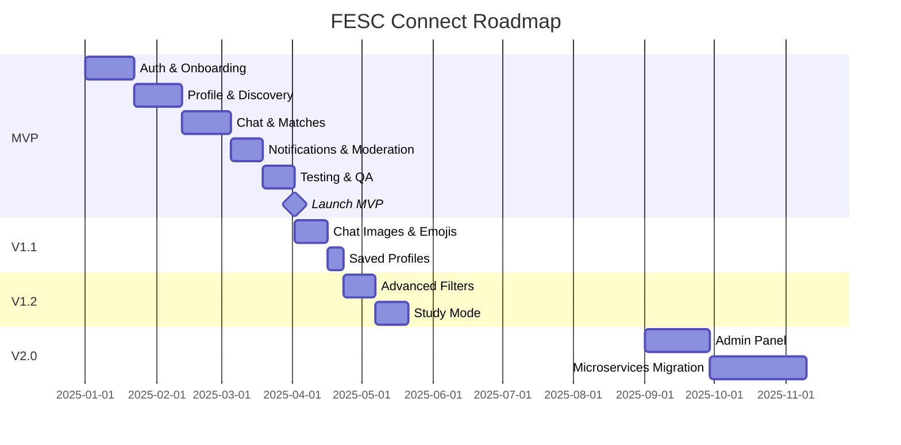

---

## 16. Riesgos y Mitigaciones

### 16.1 Riesgos Técnicos

#### RIESGO-001: Escalabilidad del Discovery Engine
**Probabilidad:** Alta | **Impacto:** Alto

**Descripción:** El cálculo del Score_de_Compatibilidad para todos los pares de usuarios es O(N²). Con 10,000 usuarios activos, esto representa 100M de cálculos potenciales.

**Mitigación:**
1. **Caché agresivo en Redis:** Los scores se cachean por 6 horas. Solo se recalculan cuando cambia el perfil de alguno de los usuarios.
2. **Pre-cálculo incremental:** Un job nocturno pre-calcula scores para los pares más probables (misma carrera, semestre cercano).
3. **Filtrado previo al scoring:** Antes de calcular scores, se aplican filtros duros (edad, carrera, bloqueos) para reducir el conjunto de candidatos.
4. **Índices optimizados:** Índice compuesto en `profiles(career, semester, age, last_active_at)` para filtrado eficiente.

```typescript
// Estrategia de pre-filtrado antes del scoring
async function getDiscoveryCandidates(userId: string, filters: DiscoveryFilter): Promise<string[]> {
  // 1. Filtro duro en DB (rápido, usa índices)
  const candidates = await prisma.profile.findMany({
    where: {
      userId: { not: userId },
      age: { gte: filters.minAge, lte: filters.maxAge },
      career: filters.career ?? undefined,
      user: {
        status: 'ACTIVE',
        // Excluir bloqueados
        blocksGiven: { none: { blockedId: userId } },
        blocksReceived: { none: { blockerId: userId } },
      },
    },
    select: { userId: true },
    take: 100, // Máximo 100 candidatos para scoring
  });
  
  return candidates.map((c) => c.userId);
}
```

---

#### RIESGO-002: Escalabilidad de WebSocket con Múltiples Instancias
**Probabilidad:** Media | **Impacto:** Alto

**Descripción:** Socket.io por defecto no comparte estado entre instancias del servidor. Con múltiples instancias, un usuario en la instancia A no puede recibir mensajes de un usuario en la instancia B.

**Mitigación MVP:** Usar una sola instancia del servidor (suficiente para el MVP con < 1,000 usuarios concurrentes).

**Mitigación Post-MVP:** Implementar Redis Adapter para Socket.io:
```typescript
import { createAdapter } from '@socket.io/redis-adapter';
import { createClient } from 'redis';

const pubClient = createClient({ url: process.env.REDIS_URL });
const subClient = pubClient.duplicate();

await Promise.all([pubClient.connect(), subClient.connect()]);
io.adapter(createAdapter(pubClient, subClient));
```

---

#### RIESGO-003: Abuso del Sistema de Chat Abierto
**Probabilidad:** Alta | **Impacto:** Medio

**Descripción:** Al no requerir match para chatear, existe riesgo de mensajes no deseados, acoso y spam.

**Mitigación:**
1. **Rate limiting:** 50 mensajes/hora hacia usuarios sin match (Req 12.4)
2. **Detección de spam:** Bloqueo automático de URLs repetidas y texto idéntico a múltiples usuarios (Req 12.5)
3. **Shadow moderation:** Reducción de visibilidad para usuarios con múltiples reportes (Req 12.3)
4. **Bloqueo fácil:** Acceso directo al bloqueo desde cualquier conversación
5. **Moderación humana:** Panel de administración para revisar reportes (Post-MVP)

---

#### RIESGO-004: Seguridad de Tokens JWT
**Probabilidad:** Baja | **Impacto:** Crítico

**Descripción:** Robo de tokens de acceso o refresco podría comprometer cuentas de usuarios.

**Mitigación:**
1. **Almacenamiento seguro:** Tokens exclusivamente en Expo Secure Store (Keychain en iOS, Keystore en Android)
2. **Rotación de refresh tokens:** Cada uso del refresh token genera un nuevo par (Req 2.2)
3. **Detección de IP sospechosa:** Alerta si el token se usa desde una IP diferente (Req 13.6)
4. **Expiración corta:** Access token expira en 15 minutos
5. **Revocación inmediata:** Al detectar actividad sospechosa, revocar todos los tokens activos

---

#### RIESGO-005: Rendimiento de Carga de Imágenes
**Probabilidad:** Media | **Impacto:** Medio

**Descripción:** Las fotos de perfil (hasta 6 por usuario, hasta 10 MB cada una) pueden generar latencia significativa en la pantalla de discovery.

**Mitigación:**
1. **Optimización en upload:** Comprimir imágenes a máximo 1 MB antes de almacenar (Req 4.7)
2. **CDN:** Servir imágenes desde CloudFront con caché agresivo
3. **Lazy loading:** Cargar fotos de la galería solo cuando el usuario las solicita
4. **Thumbnails:** Generar versiones reducidas (200x200, 400x400) para la cola de discovery
5. **Progressive loading:** Mostrar placeholder mientras carga la imagen de alta resolución

---

#### RIESGO-006: Privacidad y Cumplimiento de Datos
**Probabilidad:** Media | **Impacto:** Alto

**Descripción:** Manejo de datos personales de estudiantes universitarios requiere cumplimiento con regulaciones de privacidad colombianas (Ley 1581 de 2012).

**Mitigación:**
1. **Soft deletes:** Los datos no se eliminan físicamente de inmediato, pero se marcan como eliminados
2. **Eliminación completa:** Proceso de eliminación de cuenta en < 30 días (Req 13.5)
3. **Datos mínimos:** Solo se recopilan datos necesarios para el funcionamiento
4. **Consentimiento explícito:** Términos y condiciones claros durante el registro
5. **Auditoría:** Log de todas las acciones de moderación (Req 12.7)
6. **HTTPS obligatorio:** TLS 1.2+ en todas las comunicaciones (Req 13.4)

---

#### RIESGO-007: Adopción y Masa Crítica
**Probabilidad:** Alta | **Impacto:** Alto

**Descripción:** Una red social universitaria requiere masa crítica de usuarios para ser útil. Sin suficientes perfiles, la cola de discovery se agota rápidamente.

**Mitigación:**
1. **Estrategia de lanzamiento por facultad:** Lanzar primero en una facultad para concentrar usuarios
2. **Mensaje de cola vacía:** Sugerir ampliar filtros cuando la cola se agota (Req 6.9)
3. **Notificaciones de nuevos usuarios:** Alertar cuando hay nuevos perfiles que coinciden con los filtros
4. **Gamificación:** Badges y logros para incentivar completar el perfil y ser activo
5. **Integración institucional:** Colaborar con la universidad para promoción oficial

---

### 16.2 Matriz de Riesgos

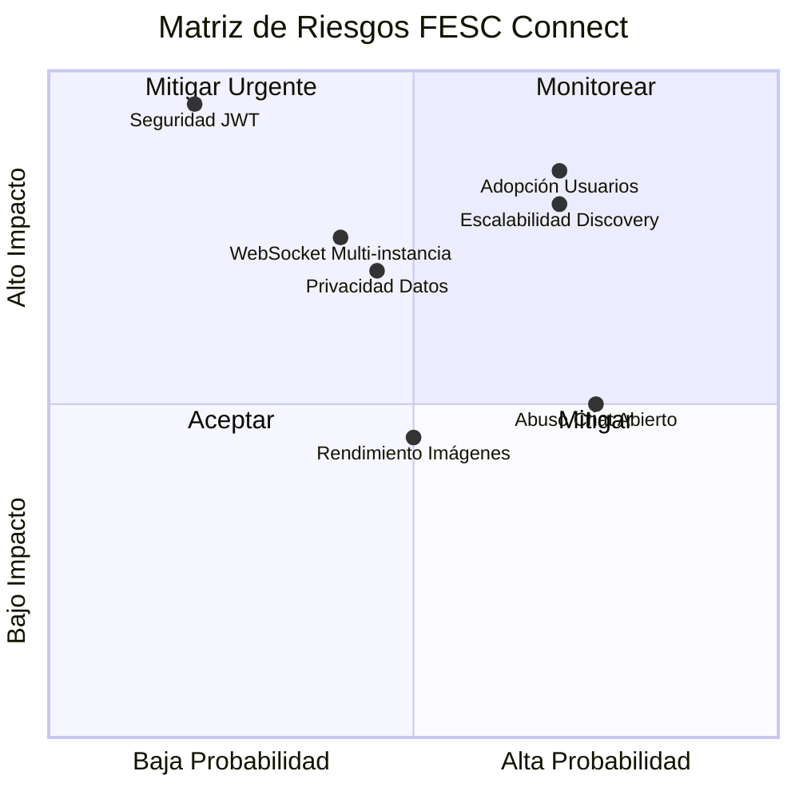

---

*Documento generado para FESC Connect v1.0.0*  
*Última actualización: 2025*  
*Próxima revisión: Al completar el MVP*
